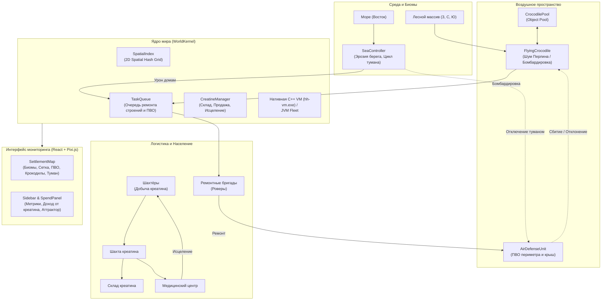

# Архитектура и Руководство: Симуляция Поселка (5000 домов, Экосистема, ПВО и Креатин)

Этот документ описывает исходные подсистемы обновления на 5000 домов. Исправления после слияний и проверенное покрытие нового ТЗ приведены в [отчёте аудита](review-last-three-commits.md). Зональную экологию реализует `EcosystemController`, физические последствия применяет `WorldKernel`. Старые численные примеры ниже не заменяют замер актуального сценария.

---

## 1. Контекст рефакторинга и новые механики

В рамках перехода от сценария LV-426 к новой модели симуляции выполнен масштабный рефакторинг:

1. **Масштабирование 5000 домов:**
   - Сетка расширена с 300 до 5000 домов (более 20 000 параллельных контекстов: дома, обогреватели, чайники, жители, бригады, роверы).
   - Для исключения алгоритмической сложности $O(N^2)$ при проверке близости, видимости и коллизий внедрён 2D Spatial Hash Grid (`SpatialIndex`), сокращающий поиск до посещаемых ячеек и найденных кандидатов. Запросы зависят от радиуса и плотности; сложность не является постоянной.
2. **Топология среды и биомы:**
   - **Атмосфера:** Земная, комфортная (+19 °C), свободное дыхание жителей по всей территории по умолчанию.
   - **Лесной массив:** Окружает посёлок с трёх сторон — Запад (W), Север (N) и Юг (S). Из леса появляются воздушные угрозы.
   - **Море:** Ограничивает посёлок с четвёртой стороны — Восток (E).
3. **Морские механики (`SeaController`):**
   - **Подмывание берега:** Постоянный эрозионный урон домам, находящимся в прибрежной полосе.
   - **Локализованное смещающееся облако морского тумана:** Туман смоделирован как массивный плотный фронт испарений (~100x100 домов: 1200×1400 м). Облако зарождается в море у восточной границы посёлка и наискосок/по диагонали дрейфует на запад в сторону леса. Внутри эллипса тумана рабочие надевают респираторы (без них получают урон от удушья), а системы ПВО подвергаются коррозии и отключаются. За пределами облака сохраняется ясная видимость.
4. **Угрозы и Защита (`DefenseAndThreats`):**
   - **Летающие крокодилы (`FlyingCrocodile`):** Появляются из случайных точек лесного массива (Запад, Север, Юг) с удвоенной частотой (интервал 17.5 с вместо 35.0 с). Летят над посёлком на Восток в сторону моря по траектории с шумом Перлина (`TrajectoryNoise`). Достигнув точки разворота над морем (`turnPoint`), крокодил разворачивается во вторую фазу полёта (`FlightPhase.RETURNING`) и летит обратно в лес к уникальной точке выхода (`exitPoint`), используя независимый генератор шума для неповторимого обратного пути. При достижении леса или уничтожении ПВО объект деспавнится и возвращается в расширенный пул на 128 слотов (`CrocodilePool`).
   - **Система ПВО (`AirDefenseUnit`):** Стационарные орудия по периметру посёлка и на крышах домов. Автоматически сканируют воздух, сбивают или отклоняют траектории крокодилов. При попадании в зону морского тумана переходят в состояние поломки (`broken`) до починки.
5. **Экономика и логистический конвейер Креатина (`CreatineManager` + `WorldKernel`):**
   - **Масштабирование производительности шахты (Синергия рабочих):** Скорость добычи в шахте зависит от текущего количества работающих в ней горняков. Рассчитывается динамический коэффициент синергии:
     $$S = 1.0 + 9.0 \times \min\left(1.0, \frac{W}{5000.0}\right)$$
     (при 1 рабочем — $1.0\times$, при 750 рабочих на 4500 тике — $2.35\times$, при 5000 рабочих — максимум $10.0\times$).
   - **Сменная ротация рабочих (Shift Rotation):** Рабочие больше не задерживаются на шахте бессрочно. Смоделирован сменный цикл длительностью 1200 с (20 мин): 750 с работы на шахте, 450 с возвращения домой и отдыха. Рабочие сдвинуты по фазе слотами (`(slot * 37) % 1200`), обеспечивая постоянный плавный поток сменяющихся смен.
   - **Лечение пострадавших в Медцентре:** При получении ранений (`health < 90`) рабочие направляются в `medicalCenter` (пешком или на такси-роверах), где восстанавливают здоровье до 100 hp за счёт медицинского запаса креатина, после чего возвращаются в трудовой цикл.
6. **Флот из 150 роверов со строгим разделением ролей (50 / 50 / 50):**
   - **50 Ремонтных роверов (`crew-1` .. `crew-50`):** Размещены по сетке $5 \times 10$ секторных постов по всему посёлку. Занимаются исключительно ремонтом домов, ПВО и коммуникаций. Никогда не отвлекаются на перевозку пассажиров или грузов.
   - **50 Грузовых роверов (`cargo-1` .. `cargo-50`):** Занимаются исключительно перевозкой креатина:
     - 25 роверов (`cargo-1` .. `cargo-25`): возят сырой креатин с Шахты на Склад (`Mine` ↔ `Depository`).
     - 25 роверов (`cargo-26` .. `cargo-50`): возят очищенный креатин со Склада в Медицинский центр (`Depository` ↔ `MedicalCenter`).
   - **50 Пассажирских роверов / такси (`transport-1` .. `transport-50`):** Распределены по жилым секторам. Перевозят жителей на работу, домой, а также оперативно доставляют раненых в медицинский центр.
7. **2D Визуализация на карте (Pixi.js + Server-Sent Events):**
   - Все сущности отображаются уникальными векторными SVG-иконками (включая дифференцированные метки роверов: `РЕМ`, `ГРУЗ`, `ТАКСИ`).
   - Ксеноморфы удалены из легенды карты (`map-legend-grid`) и фильтруются из панели слоев при отсутствии в симуляции.
   - Облако морского тумана передаётся через виртуальную погодную сущность `weather/sea_fog` и отрисовывается в виде полупрозрачного многослойного эллипса, перемещающегося по карте в реальном времени.

---

## 2. Диаграмма взаимодействия компонентов



---

## 3. Структура кодовой базы

| Путь к файлу | Назначение и ключевые компоненты |
|---|---|
| [`colony-dsl-parser/src/main/kotlin/colony/world/SpatialIndex.kt`](../colony-dsl-parser/src/main/kotlin/colony/world/SpatialIndex.kt) | 2D Spatial Hash Grid. Индексация координат, поиск соседей в посещаемых ячейках радиуса `queryRadius`. |
| [`colony-dsl-parser/src/main/kotlin/colony/world/SeaController.kt`](../colony-dsl-parser/src/main/kotlin/colony/world/SeaController.kt) | Контроллер моря: эрозия прибрежных строений, цикл морского тумана, зона поражения. |
| [`colony-dsl-parser/src/main/kotlin/colony/world/DefenseAndThreats.kt`](../colony-dsl-parser/src/main/kotlin/colony/world/DefenseAndThreats.kt) | Классы `TrajectoryNoise` (1D Perlin), `FlyingCrocodile`, пул `CrocodilePool`, орудия `AirDefenseUnit`. |
| [`colony-dsl-parser/src/main/kotlin/colony/world/CreatineManager.kt`](../colony-dsl-parser/src/main/kotlin/colony/world/CreatineManager.kt) | Логика экономики креатина: учёт добычи, коммерческая продажа в гроссбух, исцеление жителей. |
| [`colony-dsl-parser/src/main/kotlin/colony/world/TaskQueue.kt`](../colony-dsl-parser/src/main/kotlin/colony/world/TaskQueue.kt) | Глобальная очередь ремонтных задач с привязкой к координатам и spatial-индексу. |
| [`colony-dsl-parser/src/main/kotlin/colony/world/Topology.kt`](../colony-dsl-parser/src/main/kotlin/colony/world/Topology.kt) | Генерация топологии: дома, ЛЭП, водопровод, склад, медцентр, ПВО по периметру и крышам. |
| [`colony-dsl-parser/src/main/kotlin/colony/world/WorldKernel.kt`](../colony-dsl-parser/src/main/kotlin/colony/world/WorldKernel.kt) | Главный физический цикл: интеграция моря, угроз, ПВО, креатина, респираторов и ремонта. |
| [`examples/physics/settlement-5000.json`](../examples/physics/settlement-5000.json) | Конфигурация сценария на 5000 домов: земной климат (+19 °C), активное море, ПВО, креатин. |
| [`frontend/src/domain/mapPresentation.ts`](../frontend/src/domain/mapPresentation.ts) | Определение типов `air_defense`, `crocodile`, `depository`, `medical_center` и их SVG-иконок. |
| [`frontend/src/components/SettlementMap.tsx`](../frontend/src/components/SettlementMap.tsx) | Отрисовка карты на Pixi.js: отображение леса, моря, динамического тумана, юнитов ПВО и угроз. |
| [`frontend/src/components/Sidebar.tsx`](../frontend/src/components/Sidebar.tsx) | Информационная панель сущностей: состояние ПВО, запас креатина, урон от моря, респираторы. |
| [`frontend/src/components/SpendPanel.tsx`](../frontend/src/components/SpendPanel.tsx) | Финансовый отчёт с отображением строк дохода от экспорта креатина (`creatine_sale`). |

---

## 4. Как запускать проект

### Вариант 1: Быстрый запуск, перезапуск и остановка в один клик из VS Code

В проекте настроены задачи [`.vscode/tasks.json`](../.vscode/tasks.json):

1. **Запуск симулятора (с автоматической очисткой прошлой сессии):**
   - Нажмите **`Ctrl + Shift + B`** (или `Terminal` → `Run Build Task...`).
   - Скрипт **завершает прежние процессы этого проекта**, освобождает порты 8080 и 5173 и запускает свежую сессию.
2. **Остановка текущей сессии:**
   - Откройте меню `Terminal` → `Run Task...` (Выполнить задачу) → выберите **`Остановить симуляцию (5000 домов)`**.
   - Это гарантированно выключит и JVM-сервер, и Vite, освободит порты и оперативную память.
3. **Полный перезапуск:**
   - Выберите задачу **`Перезапуск симулятора (5000 домов + Экосистема)`**.

- **UI мониторинга:** <http://localhost:5173>
- **Backend API:** <http://localhost:8080>

### Вариант 2: Запуск и остановка через консоль PowerShell

Из корневой директории проекта:

- **Полная остановка симуляции:**
  ```powershell
  .\scripts\stop-5000.ps1
  ```
- **Запуск симуляции:**
  ```powershell
  .\scripts\start-5000.ps1 -Scenario examples/physics/settlement-5000.json
  ```
  *(Скрипт автоматически вызывает `stop-5000.ps1` перед запуском, исключая конфликты портов и процессов).*

### Вариант 3: Ручной запуск (для отладки)

**Терминал 1 (Backend):**
```powershell
# Установите переменные окружения и скомпилируйте дистрибутив
$env:JAVA_OPTS = "-Xms512m -Xmx2g"
$env:HH_REFERENCE_WORKERS = "4"
$env:HH_COMPACT_OBSERVER = "1"
.\colony-dsl-parser\gradlew.bat -p colony-dsl-parser installDist

# Запуск сервера на порту 8080
.\colony-dsl-parser\build\install\colony-dsl-parser\bin\colony-dsl-parser.bat serve examples/physics/settlement-5000.json 8080
```

**Терминал 2 (Frontend):**
```powershell
Set-Location frontend
npm ci
npm run dev
```

Откройте в браузере: <http://localhost:5173>.

---

## 5. Запуск тестов и проверка работоспособности

Проверки компонентов (актуальный результат и ограничения — в отчёте аудита):

1. **Тесты симуляции и компилятора (Gradle / Kotlin):**
   ```powershell
   .\colony-dsl-parser\gradlew.bat -p colony-dsl-parser test
   ```
   Включает интеграционный тест [`LargeScaleSettlementTest`](../colony-dsl-parser/src/test/kotlin/colony/world/LargeScaleSettlementTest.kt), проверяющий 5000 домов, Spatial Indexing, эрозию моря, туман, ПВО, крокодилов и экономику креатина.

2. **Тесты фронтенда (Vitest):**
   ```powershell
   npm --prefix frontend test -- --run
   ```

3. **Сборка фронтенда (TypeScript + Vite):**
   ```powershell
   npm --prefix frontend run build
   ```

4. **Тесты нативной виртуальной машины (C++ CTest):**
   ```powershell
   cmake -S native -B native/build -DCMAKE_BUILD_TYPE=Release
   cmake --build native/build --config Release
   ctest --test-dir native/build -C Release --output-on-failure
   ```

---

## 6. Руководство по расширению для разработчиков и AI-моделей

При добавлении новых сущностей и механик соблюдайте следующий конвейер:

1. **Конфигурация (`WorldConfig.kt`):**
   - Добавьте дата-класс настроек с валидацией значений (например, `CustomConfig`).
   - Добавьте поле в `WorldConfig` со значением по умолчанию `enabled = false` для сохранения обратной совместимости conformance-тестов.
2. **Топология и Фикстуры (`Topology.kt`):**
   - При необходимости добавьте новый `FixtureKind` (например, вышки связи, турели).
   - Зарегистрируйте размещение в `buildTopology(...)`.
3. **Физический цикл (`WorldKernel.kt`):**
   - Добавьте вызов шага обновления в метод `step(...)` ядра.
   - Используйте `spatialIndex.queryRadius(...)` вместо перебора списков $O(N)$ для любых проверок радиуса.
   - Публикуйте события через `events += ...` и проводки через `postings += ...`.
   - В методе `view(...)` предоставьте необходимые метрики сущности.
4. **Фронтенд представление (`types.ts`, `mapPresentation.ts`):**
   - Добавьте имя сущности в `KNOWN_ENTITY_TYPES` в `types.ts`.
   - Зарегистрируйте цвет, размер и SVG-контур в `MAP_TYPES` в `mapPresentation.ts`.
   - Если сущность подвижна — добавьте её в `MOBILE_LAYERS`.
5. **UI панели (`SettlementMap.tsx`, `Sidebar.tsx`):**
   - В `SettlementMap.tsx` обновите всплывающую подсказку (`tooltip`) и легенду.
   - В `Sidebar.tsx` добавьте карточку с детальными характеристиками сущности.
