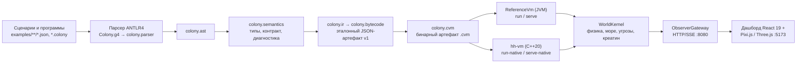
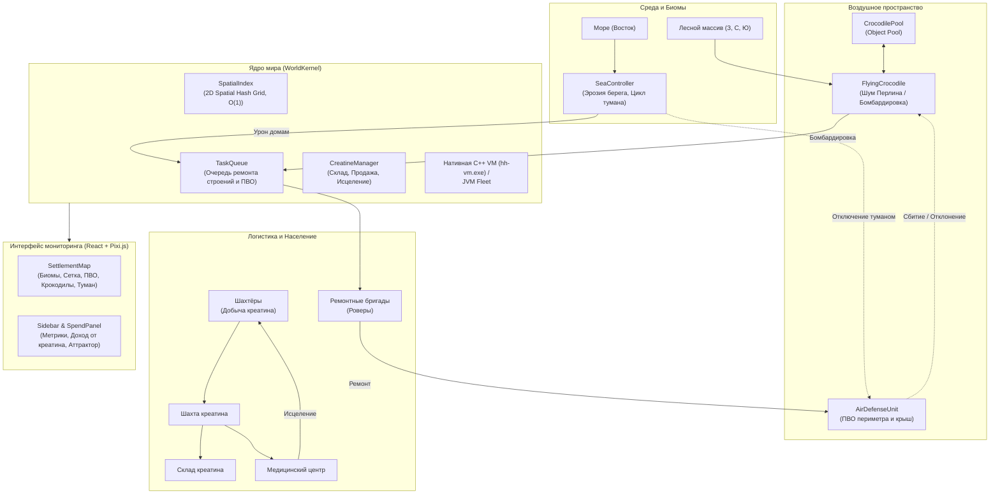
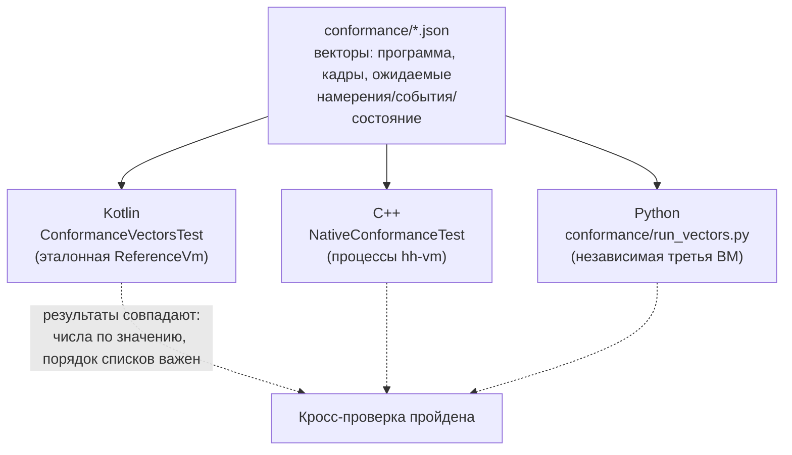

# Архитектура: Симуляция Поселка (5000 домов, Экосистема, ПВО и Креатин)

> **Статус:** актуально · **Обновлять при:** изменении компонентов, их границ, потоков данных или структуры кодовой базы

Документ описывает архитектуру, взаимосвязи подсистем и алгоритмы для разработчиков команды и LLM/AI-агентов.
Смежные документы: [requirements.md](requirements.md) (цели и границы), [spec/](spec/colony-language.md) (язык, исполнение, формат .cvm, HTTP/SSE),
[adr/](adr/) (почему устроено так), [glossary.md](glossary.md) (термины).

**Суть в одном абзаце.** Программы на DSL Colony компилируются в стековый байт-код `.cvm` и исполняются
двумя ВМ — эталонной JVM (`ReferenceVm`) и нативной C++ (`hh-vm`), которые сверяются conformance-векторами.
Ядро мира `WorldKernel` детерминированно разрешает намерения и считает физику посёлка на 5000 домов
(~20 028 контекстов поведения); `ObserverGateway` публикует состояние по HTTP/SSE (:8080),
React-дашборд с Pixi.js/Three.js рисует карту (:5173).

---

## 1. Механики экосистемы

Переход от сценария LV-426 к новой модели симуляции: что добавлено и по каким правилам работает.

| Блок | Что делает | Ключевые правила и цифры |
|---|---|---|
| **Масштабирование** | Сетка расширена с 300 до 5000 домов: дома, обогреватели, чайники, жители, бригады, роверы — более 20 000 параллельных контекстов | 2D Spatial Hash Grid (`SpatialIndex`) даёт проверки близости/видимости/коллизий за $O(1)$ вместо $O(N^2)$ |
| **Топология и биомы** | Атмосфера земная, комфортная (+19 °C), свободное дыхание по всей территории; лес окружает с З, С и Ю; море — с В | Из леса появляются воздушные угрозы; море ограничивает с четвёртой стороны |
| **Море (`SeaController`)** | Эрозионный урон домам прибрежной полосы; плотное смещающееся облако тумана (~100×100 домов: 1200×1400 м) зарождается у восточной границы и дрейфует по диагонали к лесу | Внутри эллипса тумана рабочие без респиратора получают урон от удушья, ПВО коррозируется и отключается; вне облака — ясная видимость |
| **Угрозы (`FlyingCrocodile`)** | Вылетают из случайных точек леса, летят над посёлком к морю по траектории с шумом Перлина (`TrajectoryNoise`); от точки разворота (`turnPoint`) возвращаются во второй фазе (`FlightPhase.RETURNING`) к уникальной точке выхода (`exitPoint`) с независимым шумом; по достижении леса или уничтожении — деспавн в пул `CrocodilePool` | Интервал появления 17.5 с (удвоенная частота); пул на 128 слотов |
| **Защита (`AirDefenseUnit`)** | Стационарные орудия по периметру и на крышах: сканируют воздух, сбивают или отклоняют крокодилов | В зоне морского тумана переходят в `broken` до починки |
| **Экономика креатина (`CreatineManager`)** | Добыча в шахте, перевозка шахта → склад → медцентр, продажа (`creatine_sale`), лечение раненых | Синергия добычи $S = 1.0 + 9.0 \times \min(1.0, W/5000.0)$: 1 рабочий — $1.0\times$, 750 рабочих — $2.35\times$, 5000 — максимум $10.0\times$. Смены 1200 с = 750 с работы + 450 с возврата, фазы слотами `(slot × 37) % 1200`. Лечение при `health < 90` до 100 hp за счёт медзапаса креатина (пешком или на такси-роверах) |
| **Флот роверов** | 150 машин со строгими ролями: 50 ремонтных `crew-1..50` (сетка $5\times10$ постов — только ремонт домов, ПВО и коммуникаций), 50 грузовых `cargo-1..50` (25 возят сырой креатин `Mine`↔`Depository`, 25 — очищенный `Depository`↔`MedicalCenter`), 50 такси `transport-1..50` (жители на работу/домой и оперативная доставка раненых в медцентр) | Ремонтные никогда не перевозят пассажиров и грузы |
| **Визуализация (Pixi.js + SSE)** | SVG-иконки всех сущностей с метками роверов `РЕМ`/`ГРУЗ`/`ТАКСИ`; туман — виртуальная погодная сущность `weather/sea_fog` (полупрозрачный многослойный эллипс в реальном времени) | Ксеноморфы убраны из легенды карты (`map-legend-grid`) и фильтруются из слоёв при отсутствии в симуляции |

---

## 2. Диаграммы

### 2.1. Конвейер обработки: от DSL до дашборда

Проекты по слоям: [colony-dsl-parser/](../colony-dsl-parser) (компилятор, runtime, ядро мира), [native/](../native) (hh-vm),
[frontend/](../frontend) (дашборд). Детали: язык — [spec/colony-language.md](spec/colony-language.md),
исполнение и тик — [spec/runtime-tick.md](spec/runtime-tick.md), формат .cvm — [spec/cvm-format.md](spec/cvm-format.md),
наблюдение — [spec/http-api.md](spec/http-api.md).

### 2.2. Компоненты мира и интерфейса

### 2.3. Кросс-проверка исполнителей (conformance)

Векторы генерируются командой CLI `conformance` и сверяются тестами; подробнее — [AGENTS.md](../AGENTS.md).

---

## 3. Структура кодовой базы

| Путь к файлу | Назначение и ключевые компоненты |
|---|---|
| [`colony-dsl-parser/src/main/kotlin/colony/world/SpatialIndex.kt`](../colony-dsl-parser/src/main/kotlin/colony/world/SpatialIndex.kt) | 2D Spatial Hash Grid. Индексация координат, поиск соседей в радиусе `queryRadius` за $O(1)$. |
| [`colony-dsl-parser/src/main/kotlin/colony/world/SeaController.kt`](../colony-dsl-parser/src/main/kotlin/colony/world/SeaController.kt) | Контроллер моря: эрозия прибрежных строений, цикл морского тумана, зона поражения. |
| [`colony-dsl-parser/src/main/kotlin/colony/world/DefenseAndThreats.kt`](../colony-dsl-parser/src/main/kotlin/colony/world/DefenseAndThreats.kt) | Классы `TrajectoryNoise` (1D Perlin), `FlyingCrocodile`, пул `CrocodilePool`, орудия `AirDefenseUnit`. |
| [`colony-dsl-parser/src/main/kotlin/colony/world/CreatineManager.kt`](../colony-dsl-parser/src/main/kotlin/colony/world/CreatineManager.kt) | Логика экономики креатина: учёт добычи, коммерческая продажа в гроссбух, исцеление жителей. |
| [`colony-dsl-parser/src/main/kotlin/colony/world/TaskQueue.kt`](../colony-dsl-parser/src/main/kotlin/colony/world/TaskQueue.kt) | Глобальная очередь ремонтных задач с привязкой к координатам и spatial-индексу. |
| [`colony-dsl-parser/src/main/kotlin/colony/world/Topology.kt`](../colony-dsl-parser/src/main/kotlin/colony/world/Topology.kt) | Генерация топологии: дома, ЛЭП, водопровод, склад, медцентр, ПВО по периметру и крышам. |
| [`colony-dsl-parser/src/main/kotlin/colony/world/WorldKernel.kt`](../colony-dsl-parser/src/main/kotlin/colony/world/WorldKernel.kt) | Главный физический цикл: интеграция моря, угроз, ПВО, креатина, респираторов и ремонта. |
| [`examples/physics/settlement-5000.json`](../examples/physics/settlement-5000.json) | Конфигурация сценария на 5000 домов: земной климат (+19 °C), активное море, ПВО, креатин. |
| [`frontend/src/domain/mapPresentation.ts`](../frontend/src/domain/mapPresentation.ts) | Определение типов `air_defense`, `crocodile`, `depository`, `medical_center` и их SVG-иконок. |
| [`frontend/src/components/SettlementMap.tsx`](../frontend/src/components/SettlementMap.tsx) | Отрисовка карты на Pixi.js: отображение леса, моря, динамического тумана, юнитов ПВО и угроз. |
| [`frontend/src/components/Sidebar.tsx`](../frontend/src/components/Sidebar.tsx) | Информационная панель сущностей: состояние ПВО, запас креатина, урон от моря, респираторы. |
| [`frontend/src/components/SpendPanel.tsx`](../frontend/src/components/SpendPanel.tsx) | Финансовый отчёт с отображением строк дохода от экспорта креатина (`creatine_sale`). |

---

## 4. Как запускать проект

Способы запуска — в [README](../README.md#запуск): VS Code в один клик (задачи
[`.vscode/tasks.json`](../.vscode/tasks.json)), PowerShell-скрипты `scripts/start-5000.ps1` / `stop-5000.ps1`,
Docker (`docker compose up --build`) и ручной запуск. Здесь запуск не дублируется.

## 5. Запуск тестов и проверка работоспособности

Полный список команд сборки, запуска и проверок (Gradle, CTest, Vitest, conformance-векторы, регенерация
контракта) — в [AGENTS.md](../AGENTS.md). Интеграционный тест крупного масштаба:
[`LargeScaleSettlementTest`](../colony-dsl-parser/src/test/kotlin/colony/world/LargeScaleSettlementTest.kt)
(5000 домов, spatial-индекс, эрозия моря, туман, ПВО, крокодилы, экономика креатина).

---

## 6. Руководство по расширению для разработчиков и AI-моделей

При добавлении новых сущностей и механик — пять шагов конвейера:

1. **Конфигурация** — [WorldConfig.kt](../colony-dsl-parser/src/main/kotlin/colony/world/WorldConfig.kt): дата-класс настроек с валидацией + поле в `WorldConfig` с `enabled = false` (обратная совместимость conformance-тестов).
2. **Топология** — [Topology.kt](../colony-dsl-parser/src/main/kotlin/colony/world/Topology.kt): новый `FixtureKind` при необходимости и размещение в `buildTopology(...)`.
3. **Физика** — [WorldKernel.kt](../colony-dsl-parser/src/main/kotlin/colony/world/WorldKernel.kt): шаг обновления в `step(...)`; проверки радиуса — только `spatialIndex.queryRadius(...)`, не перебором; события `events += ...`, проводки `postings += ...`; метрики сущности — в `view(...)`.
4. **Представление** — [types.ts](../frontend/src/domain/types.ts): вид в `KNOWN_ENTITY_TYPES`; [mapPresentation.ts](../frontend/src/domain/mapPresentation.ts): цвет/размер/SVG в `MAP_TYPES`, движущиеся — в `MOBILE_LAYERS`.
5. **UI** — [SettlementMap.tsx](../frontend/src/components/SettlementMap.tsx): tooltip и легенда; [Sidebar.tsx](../frontend/src/components/Sidebar.tsx): карточка сущности.
