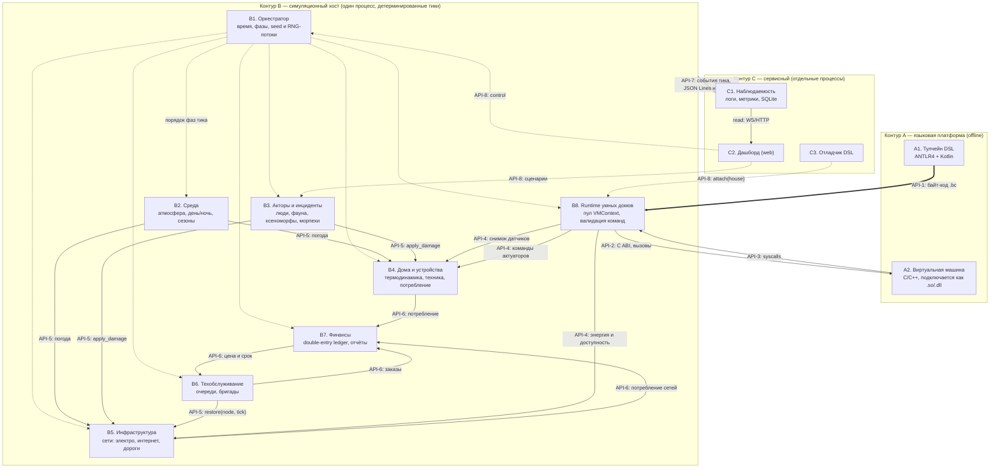
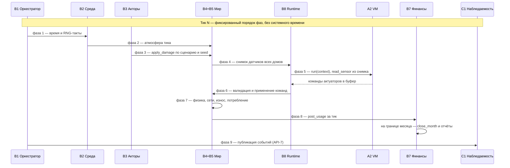
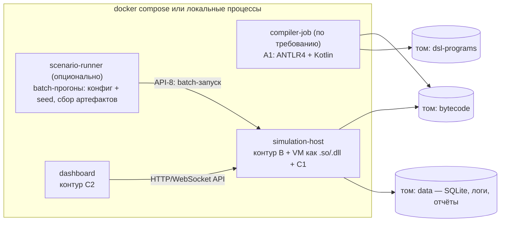

# Архитектура v0.1 — симуляция шахтёрского посёлка

> ⚠️ **ВНИМАНИЕ: тестовая (предварительная) архитектура.**
> Документ фиксирует рабочую версию проекта **до согласования** по открытым вопросам, перечисленным в файле [`docs/open-questions.md`](../open-questions.md). После получения ответов преподавателя архитектура подлежит пересмотру.
>
> **Ключевое ограничение трактовки ТЗ:** собственный язык программирования вместе с виртуальной машиной применяется **только для логики умных домов** (чтение своих датчиков, команды своим устройствам, время, лог — в пределах одного дома). DSL и VM не используются для симуляции среды, инфраструктуры посёлка, экономики или каких-либо иных частей системы.

## 1. Назначение и рамки

### 1.1. Что требует ТЗ 

Архитектура покрывает полный состав требований задания:

| Требование ТЗ | Модули |
|---|---|
| Посёлок на 300 домов, умные дома | B4 + B8 + A2 |
| Симуляция внешней среды: атмосфера (температура, состав, влажность, давление, ветер, дождь, снег, день/ночь) | B2 |
| Люди (хозяева, гости, воры, вандалы), дикие животные | B3 (+ потребительская модель хозяев — B4) |
| Дом: стены и окна с толщиной и теплопроводностью; отопление, водоснабжение, канализация (аэрационная станция), бытовая техника | B4 |
| Дороги, шлагбаумы, уличное освещение, вывоз мусора, ремонт дорог | B5 (объекты) + B6 (обслуживание) |
| Проводной интернет по столбам | B5 |
| Электроснабжение: СЭС, ИБП, электросеть, атомный реактор (как источник энергобаланса) | B5 |
| Свой DSL для умного дома | A1 |
| Компилятор ANTLR4 + Kotlin | A1 |
| VM байт-кода на C/C++ | A2 |
| Среда исполнения VM | B8 |
| Средства мониторинга и отладки | C1 (мониторинг) + C3 (отладка) |
| Финансы: всё стоит денег; помесячный отчёт по общему имуществу и по каждому домовладельцу | B7 |
| Дашборд проблем посёлка и каждого дома | C2 |
| Логи и метрики | C1 |
| Имитация проблем: погода рвёт провода, ксеноморфы/морпехи/вандалы/животные/вездеход уничтожают оборудование; каскады «нет света → промерзание → лопаются трубы» | B2 (погодные повреждения) + B3 (акторы) + эмерджентная физика B4/B5 |

### 1.2. Проектные гипотезы (НЕ из ТЗ, приняты по умолчанию)

Каждая гипотеза пересматривается по факту ответа заказчика; смена гипотезы не меняет структуру архитектуры, только параметры.

| № | Гипотеза | Основание |
|---|---|---|
| Г-1 | Команда ~10 человек, 1 человек = 1–2 модуля | оргпрактика, не ТЗ |
| Г-2 | Целевое железо: один ноутбук ~16 ГБ ОЗУ | ограничение среды обучения, не ТЗ |
| Г-3 | Язык хоста симуляции — Python; дашборд — web-стек (FastAPI + WebSocket) | «любой язык» по ТЗ; скорость разработки |
| Г-4 | Упаковка — Docker compose / локальные процессы | удобство доставки, не ТЗ |
| Г-5 | Финальный MVP подтверждается на 300 домах (PoC допустим на 1 доме) | интерпретация границы MVP |
| Г-6 | Реактор — источник энергобаланса без физики ядра | разрешение неоднозначности ТЗ |

---

## 2. Стиль архитектуры и ключевые решения

**Стиль:** модульный монолит. Один процесс симуляции (контур B) с детерминированными тиками; офлайновая языковая платформа (контур A); сервисный контур (контур C). Микросервисы на горячем пути тика запрещены: домам, инфраструктуре и экономике нужен согласованный снимок мира на каждом тике.

**Ключевые решения:**

1. **Тик — транзакция над миром.** Фиксированный порядок фаз (§5), единый снимок состояния, никаких перекрёстных чтений «на живую».
2. **Два независимых контракта языковой пары.** «Компилятор → байт-код → VM» (API-1) и «Runtime ↔ VM через C ABI» (API-2). Формат байт-кода версионированный: v0.x до стабилизации DSL, заморозка v1.0 — после фиксации словаря языка (не раньше).
3. **Периметр DSL — только свой дом.** Программа читает свои датчики, выдаёт команды своим устройствам, узнаёт время, пишет лог. Недоступны: чужие дома, деньги, инфраструктура посёлка, управление симуляцией.
4. **DSL не заявляет потребление.** Программа выражает намерения (команды устройствам); фактические кВт·ч и литры вычисляет физическая модель мира (B4/B5). Деньги возникают только из событий мира. Syscall вида «запросить списание» отсутствует по построению.
5. **Детерминизм.** Seed и именованные RNG-потоки принадлежат Оркестратору (`env`, `actors`, `wear`, `chaos`); собственные источники случайности в модулях запрещены; системное время запрещено — только `now()` от Оркестратора. Прогон воспроизводим бит-в-бит при том же seed и конфиге.
6. **Data plane ≠ control plane.** События и наблюдение (read-only) отделены от команд (пауза, скорость, сценарии, отладка, API-8). Интерактивное вмешательство помечает прогон как невоспроизводимый; хаос-сценарии по умолчанию — детерминированная функция конфига и seed.
7. **Наблюдаемость — подписчик, не участник тика.** JSON Lines и SQLite — на границе контуров; внутри процесса — типизированные события с полным порядком внутри тика.
8. **Масштаб 300 домов.** Посёлок — один объект симуляции; байт-код шарится между домами; у каждого дома собственный `VMContext` (переменные, таймеры, стек, лимиты исполнения, watchdog); на тике — снимок датчиков → исполнение → валидация → применение в фиксированном порядке.

**Многоязычность (по ТЗ):** Kotlin + ANTLR4 — компилятор; C/C++ — VM; Python (гипотеза Г-3) — хост симуляции; web-стек — дашборд. Контракты между языками: байт-код (API-1) и C ABI (API-2).

---

## 3. Модули

| ID | Модуль | Ответственность | Экспортирует | Изолирован от |
|----|--------|-----------------|--------------|----------------|
| A1 | Тулчейн DSL | грамматика, семантика, компилятор (ANTLR4+Kotlin), диагностика ошибок | API-1 | рантайма, симуляции — полностью |
| A2 | Виртуальная машина | интерпретатор байт-кода, изоляция контекстов, лимиты исполнения | API-2, API-3 | домов, симуляции, денег, времени суток |
| B1 | Оркестратор | цикл тика, фазы, seed и RNG-потоки, режимы (realtime/batch/пауза), конфиг прогона | API-7 (события), API-8 | предметных доменов |
| B2 | Среда | абиотика: атмосфера (температура, состав, влажность, давление, ветер, осадки), день/ночь, сезоны; погодные повреждения (через API-5 + поток `env`) | API-5 (погода, damage) | домов, денег, программ |
| B3 | Акторы и инциденты | люди (хозяева, гости, воры, вандалы), фауна, ксеноморфы, морпехи, вездеход; сценарии поведения, хаос-сценарии | API-5 (apply_damage), API-8 (load_scenario) | физики, тарифов |
| B4 | Дома и устройства | термодинамика стен/окон (толщина, теплопроводность), промерзание, трубы, техника, отопление, водоснабжение, аэрационная станция; **вычисление фактического потребления**; потребительская модель хозяев | API-4 (снимок/команды), API-6 (потребление) | DSL, VM, денег |
| B5 | Инфраструктура посёлка | графы сетей: электроснабжение (СЭС, ИБП, реактор, линии, столбы), интернет, дороги/шлагбаумы/освещение; износ, достижимость, каскады доступности | API-4, API-5, API-6 | DSL, VM, денег |
| B6 | Техобслуживание | очереди ремонтов, бригады, сроки; плановые сервисы (вывоз мусора, ремонт дорог); восстановление узлов по расписанию | API-5 (restore), API-6 (заказы/счета) | тарифов (цена — от B7) |
| B7 | Финансы и отчётность | тарифы, double-entry ledger, закрытие месяца, отчёты (общее имущество + каждый домовладелец), долги | API-6 | физики, VM, DSL |
| B8 | Runtime умных домов | деплой байт-кода (шарится между домами), пул VMContext, watchdog, шлюз датчиков/актуаторов, валидация команд | API-1/2/3/4 | грамматики DSL, физики |
| C1 | Наблюдаемость | подписка на события, хранение (SQLite + JSON Lines), retention, запросы | API-7 (подписка/чтение) | бизнес-логики всех модулей |
| C2 | Дашборд | визуализация посёлка и каждого дома, проблемы, отчёты, drill-down | read к C1; API-8 (control) | внутренностей модулей |
| C3 | Отладчик DSL | attach к дому, пауза, точки останова, пошаговое исполнение, инспекция снимка и контекста | API-8 к B8 | остальной системы |

Замечания к границам:

- **B2 и B3 разделены сознательно:** разные источники детерминизма (модель климата vs конфиг сценария), разный ритм (погода — каждый тик, инциденты — спорадически), разный владелец. Дикие животные отнесены к B3: всё, что совершает действия, — актор; среда — только абиотика.
- **B6 отделён от B7:** ремонт — операционная деятельность (кто, когда, чем), финансы — учёт (сколько, у кого). B6 не знает тарифов.
- **C3 — отдельный инструмент** поверх API B8, а не часть VM: отладка программы дома требует паузы конкретного контекста и инспекции датчиков, чего VM-ядро не знает.

---

## 4. Контракты (API)

Правило: контракт — версионируемый артефакт в репозитории (`/contracts`), один владелец, изменение — только через ADR. Типы контрактов различны по природе: грамматика + семантические тесты (DSL), бинарный ABI (VM), JSON Schema (данные и события), HTTP/WebSocket (UI).

| ID | Контракт | Стороны | Содержание и формат |
|----|----------|---------|---------------------|
| API-1 | Спецификация DSL + формат байт-кода | A1 → B8, A2 | грамматика ANTLR + набор семантических тестов; версионированный модуль `.bc` (версия, таблица констант, инструкции, метаданные требуемых датчиков/актуаторов). v0.x до стабилизации DSL; заморозка v1.0 — после фиксации словаря языка. Конформанс-набор исполняется и компилятором, и VM в CI |
| API-2 | C ABI виртуальной машины | B8 ↔ A2 | `vm_new / vm_load / vm_run(n) / vm_set_syscall_handler / vm_set_limits / vm_free`; нативная библиотека (.so/.dll) |
| API-3 | Syscall API | A2 → B8 (реализует B8, вызывается программой дома) | `read_sensor(id)`, `set_actuator(id, value)`, `now()`, `log(msg)`. Только свой дом; изоляция контекстов; таймаут на исполнение (watchdog гасит зависшую программу, инцидент в лог) |
| API-4 | Шлюз мира | B8 ↔ B4/B5 | снимок датчиков на тик (консистентный); приём валидированных команд актуаторов; запросы энергодоступности/сети. Команды применяются миром в фиксированной фазе тика, не мгновенно |
| API-5 | Входы мира | B2, B3, B6 → B4/B5 | погода тика; `apply_damage(node, тип)`, `restore(node, at_tick)` |
| API-6 | Экономический протокол | B4/B5/B6 ↔ B7 | `post_usage(субъект, ресурс, объём)`, `repair_request → order(цена, срок)`, `close_month() → отчёты`. Инварианты: по каждой проводке Σ дебетов = Σ кредитов; пробный баланс (сумма остатков счетов = 0); сумма отчётов домовладельцев сходится с консолидированным отчётом. Проверка — автотестом каждый прогон |
| API-7 | Поток событий | контур B → C1 (и потребителям внутри B) | типизированные события in-proc (`TickCompleted`, `WeatherChanged`, `NodeFailed`, `NodeRepaired`, `IncidentOccurred`, `UsageReported`, `MonthlyClosing`); полный порядок внутри тика; наружу (в C1) — JSON Lines |
| API-8 | Control plane | C2/C3 → B1/B3/B8 | `start / pause / rate / set_seed / load_scenario / attach_house`. Отделён от data plane; интерактивные команды помечают прогон невоспроизводимым |

---

## 5. Детерминированный тик (порядок фаз)

Единственный источник времени — B1. Порядок фаз фиксирован и не зависит от числа домов.

1. **Оркестратор (B1)** — инкремент симуляционного времени; выдача случайных чисел по именованным потокам (`env`, `actors`, `wear`, `chaos`); проверка границ (сутки, месяц).
2. **Среда (B2)** — расчёт атмосферы тика; погодные повреждения (через API-5 + поток `env`).
3. **Акторы (B3)** — решения по сценариям и потоку `actors`; повреждения через `apply_damage`.
4. **Снимок датчиков** — консистентное состояние всех домов (API-4).
5. **Исполнение программ** — B8 прогоняет `vm_run` для всех контекстов; VM читает только снимок; команды актуаторов — в буфер B8.
6. **Валидация и применение** — проверка прав (только свой дом), лимитов, рабочего состояния устройств; применение миром в фиксированном порядке домов.
7. **Физика мира (B4/B5)** — термодинамика, сети, износ, каскады доступности; вычисление фактического потребления.
8. **Техобслуживание (B6)** — прогресс ремонтов, новые заказы, восстановление узлов по расписанию (`restore`).
9. **Финансы (B7)** — проводки за тик; на границе месяца — `close_month` и генерация отчётов.
10. **Публикация событий (API-7)** — упорядоченный сброс событий тика в шину → C1.

---

## 6. Схемы

### 6.1. Компонентная схема

### 6.2. Последовательность тика

### 6.3. Развёртывание

Оговорки к развёртыванию: `scenario-runner` — только batch-оркестратор вне горячего цикла (генерирует конфиг и seed, запускает прогон, собирает артефакты); вмешательство в идущий прогон запрещено — ломает воспроизводимость. Дашборд не имеет прямого доступа к состоянию хоста, кроме read-API и control plane.
