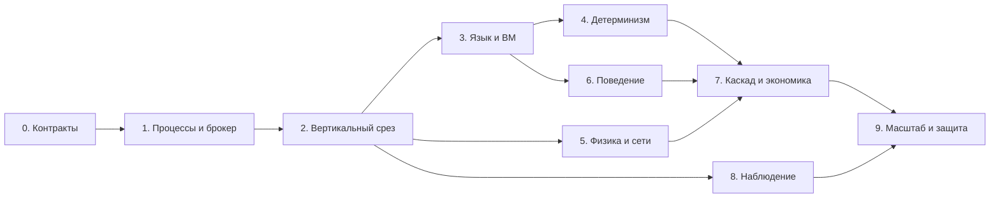

# План работ: Colony, компилятор и симуляция LV-426

Статус: план будущей реализации; код в рамках текущей задачи не создаётся. Архитектура, синтаксис и семантика подробно описаны в [language-runtime-design.md](language-runtime-design.md).

Подтверждено пользователем: 32 ГБ RAM; сети Кана служат ориентиром; 3D-представление метрик в форме торнадо пока отложено. CPU, ОС, команда и срок неизвестны, поэтому ниже указаны зависимости и результаты этапов без выдуманного календарного обещания.

## 1. Целевой результат

Должен получиться воспроизводимый учебный прототип:

1. Исходные программы Colony компилируются через ANTLR4 + Kotlin в проверяемый стековый байт-код.
2. Каждая программируемая сущность выполняет свою программу на индивидуальной C/C++ ВМ в отдельном процессе ОС.
3. Все ВМ взаимодействуют через отдельный брокер; правила времени и порядка событий не зависят от планировщика ОС.
4. Итоговый сценарий содержит около 300 домов, приборы и самостоятельных агентов. Предложенный состав — 1286 ВМ, а не 300 домов в 300 процессах вместе с их приборами.
5. DSL демонстрирует автоматику отопления, стресс и повреждение предмета человеком, движение и атаки ксеноморфа.
6. Работает каскад «повреждение сети → потеря отопления → охлаждение → трубы → ремонт → деньги».
7. Есть потребление электричества и воды, затраты, месячные отчёты общего имущества и каждого домовладельца.
8. Есть логи, метрики, общий дашборд, просмотр дома и объяснение причин аварии. Карта — опциональное расширение; 3D-визуализация отложена.

## 2. Матрица требований и границ

| Требование/источник | Что сделать в MVP | Как проверить | Что можно отложить |
|---|---|---|---|
| 300 домов, исходное задание | Генератор развёрнутого сценария, параметры/владелец каждого дома | В манифесте и ядре 300 разных домов | Ручной редактор поселения |
| ВМ на дом и прибор, новое условие | Отдельные процессы дома, обогревателя, чайника и прочих включённых в сценарий приборов | Таблица entity → PID; разные PID, загруженный байт-код и трасса выполнения | Дополнительные типы бытовой техники |
| 300+ стековых ВМ | Реальный нативный интерпретатор в каждом процессе | Дизассемблер, стековая трасса, число процессов | JIT, продвинутые оптимизации |
| Отдельный брокер | Реальный IPC-транспорт, регистрация, кадры и результаты | Остановка брокера диагностируется; межпроцессные сообщения видны в трассе | Кластер брокеров, несколько компьютеров |
| Ориентир KPN | FIFO, блокирующее ожидание, канонический сбор результатов | Задержки процессов не меняют предметный хеш | Формальное доказательство строгой KPN |
| События и вероятности | Типизированные сообщения, периоды, seed, chance/hazard | Границы вероятностей, фиксированный повтор, понятный период испытания | Сложные распределения и динамический граф процессов |
| Поведение разных сущностей | Три программы: автоматика, человек, ксеноморф | Изменение DSL меняет результат без изменения C++-поведения | Сложные деревья поведения и социальная модель |
| Погода | Все перечисленные в задании поля и документированные воздействия | День/ночь влияет на солнце, холод — на тепло, ветер/осадки — на отказы | Полная пространственная метеомодель |
| Стены/окна и отопление | Параметры материалов, теплопотери, фактическая мощность | Эталонные случаи тепловой модели | Комнаты, вентиляционная гидродинамика |
| Энергия | Реактор, солнце, ИБП, повреждаемый граф и распределитель | Энергетический баланс, отключения зависимых домов | Промышленная модель электрических режимов |
| Вода и трубы | Подача, расход, охлаждение/повреждение, ремонт | Каскад потери воды и восстановление | Полная гидравлика/канализация |
| Инфраструктура | Связность, минимальное освещение, ремонт, дороги/зоны для агентов | Повреждение меняет доступность; агент следует допустимому пути | Детализация мусора, шлагбаумов, заборов и остальных служб |
| Экономика | Тарифы, проводки, общий/личные отчёты | Суммы отчётов сходятся с первичными расходами, нет двойного учёта | Рыночные тарифы, кредиты |
| Мониторинг | Состояние поселения, дома, проблемы, метрики ВМ | Причина аварии прослеживается до расхода | Полная IDE и визуальный отладчик |
| Карта | Внутренние координаты и граф обязательны, изображение опционально | Симуляция работает headless; карта читает тот же снимок | Художественная графика и 3D |
| 3D-«торнадо» | Только сохранить временные ряды для будущей работы | Данные имеют время, единицы и seed | Выбор отображения, графика и исследование аттрактора целиком |

Подробные модели животных, морской пехоты и некоторых служб из исходного задания предлагается не включать в первый прототип. Это явное сокращение масштаба MVP, которое нужно показать преподавателю вместе с работающим обязательным набором.

## 3. Этапы с критериями готовности

### Этап 0. Зафиксировать контракты и сценарии приёмки

**Работа:** согласовать каталог сущностей, границу поведения/физики, модель тика, жизненный цикл команд, схемы сообщений, единицы, случайность, перечень упрощений и демонстрационный состав. Уточнить компьютер, срок и роли. Выбрать версию численного профиля и модельного календаря.

**Результат:** короткая спецификация языка v0.1, ISA v0.1, протокол v0.1, схема манифеста, список сценариев с ожидаемыми результатами. Изменения интерфейсов далее версионируются.

**Готово, когда:** на бумаге однозначно разыгрываются выключение отопления, две одновременные атаки, потеря процесса и переход месячного периода. У каждой записи есть один владелец, у вероятности — момент испытания, у команды — срок действия.

### Этап 1. Проверить процессы и брокер до большого компилятора

**Работа:** после начала реализации создать минимальный C++-исполнитель простейшего стекового фрагмента, брокер и супервизор. Полная грамматика пока не нужна: допустим небольшой фиксированный байт-код для нагрузочного стенда. Каждый процесс должен действительно обработать кадр и вернуть вычисленный результат.

Номера тиков, полный сбор результатов и установленный порядок входят уже в первый протокол. Этап 4 завершает и проверяет воспроизводимость, а не добавляет эти основы задним числом.

**Нагрузки:** 10 → 300 → 600 → 1200 → расчётный целевой состав 1286; число уточняется по каталогу. Проверить пустой кадр, типичный набор событий и допустимый максимальный пакет.

**Измерения:** время старта/остановки, private/committed memory, память системы целиком, CPU ожидания/работы, среднее и p95/p99 тика, сообщения/байты, очереди, дескрипторы. Отдельно проверить большую запись и одновременное чтение, чтобы обнаружить тупик транспортных буферов.

Оценить также рост журналов/телеметрии на длительном прогоне: байты за модельный час, прогноз диска на месяц и отсутствие неограниченного накопления истории в памяти.

**Сбои:** задержать одну ВМ; аварийно завершить её; остановить брокер; превысить квоту. Проверить отсутствие продвижения тика и зависших дочерних процессов после остановки.

**Готово, когда:** целевое число разных PID живёт и обменивается кадрами на компьютере с 32 ГБ, нет активного опроса в ожидании, рост очередей ограничен и получен отчёт измерений. Конкретный предел допустимого времени тика выбирается по желаемой скорости демонстрации. Не объявлять успех по одному лишь количеству запущенных процессов.

**Решение по результату:** сначала оптимизировать буферы, наблюдения, сериализацию и служебные расходы. Если ресурсов всё ещё мало, пересмотреть необязательные объекты или режим длинного прогона, сохраняя ВМ каждого дома и прибора. Рассчитать ожидаемое время месяца; не обещать его расчёт за минуты без данных.

### Этап 2. Собрать первый вертикальный сценарий

**Работа:** минимальный срез `DSL → ANTLR AST → простая типизация → байт-код → ВМ → брокер → World Kernel`. Поддержать константы, state, сравнение, if, один таймер, одно событие и запрос мощности.

**Сценарий:** дом, обогреватель, чайник и житель в отдельных процессах; переход присутствия задаётся тестовым сценарием. Дом посылает команду, обогреватель проверяет занятость и выключается.

**Результат:** маленький пример, который можно объяснить от исходной строки до изменения мощности.

**Готово, когда:** режим обогрева меняется при изменении исходной программы; при пустом доме отопление выключается с оговорённой задержкой до одного шага; старая команда включения не обходится без проверки присутствия. На этом этапе допускается минимальная физика.

### Этап 3. Завершить язык, компилятор и верификатор

**Работа:** добавить записи событий, enum, Option, единицы, правила областей видимости, схемы view, source map, таблицы обработчиков/таймеров, chance/hazard, эффекты и понятные ошибки. Описать IR и реестр предметных инструкций. Добавить дизассемблер.

**Готово, когда:** все три демонстрационные программы из концепции компилируются; неправильные типы, неизвестные адресаты, несовместимые периоды и единицы диагностируются. Верификатор отклоняет испорченный байт-код до запуска обработчика; ветки имеют совместимые типы и высоты стека.

**Параллельно:** после фиксации ISA команда ВМ может реализовывать интерпретатор, не ожидая полного синтаксиса; проверенные байт-кодовые фикстуры и общие описания типов связывают работу.

### Этап 4. Сделать исполнение воспроизводимым

**Работа:** закрытые кадры/результаты, стабильный порядок событий, барьер, предварительное и подтверждённое состояние, PRNG-потоки, журнал внешних входов, диагностика квот. Зафиксировать поведение при смерти сущности и при crash процесса.

**Готово, когда:** один сценарий при случайных задержках доставки и процессов даёт одинаковый хеш мира, состояния ВМ и предметного журнала. Без этих гарантий нельзя считать seed достаточной реализацией повторяемости.

**Минимум восстановления:** повтор всего прогона с теми же входами. Согласованные checkpoints и автоматическое продолжение после сбоя можно делать позднее.

### Этап 5. Добавить физическое ядро и сети

**Работа:** генератор связной топологии; климат; дома с параметрами стен/окон; отопление/чайник; генерация энергии, ИБП, распределение мощности; вода и трубы; наблюдения с ограниченной доступностью. Поддержать отключение моделируемой связи отдельно от транспорта брокера.

**Готово, когда:** питание и вода распределяются в пределах источников, потребление считается по фактическим значениям, повреждение участка затрагивает правильные дома, охлаждение соответствует выбранным уравнениям. При отсутствии всех теплопотерь и потоков температура не меняется.

**Явные границы:** примитивная физика допустима, скрытые взаимоисключающие модели и двойное владение температурой — нет. Расширение каждой модели должно иметь проверяемую причину, а не только увеличивать количество классов.

### Этап 6. Написать поведение людей, ксеноморфов и ремонта

**Работа:** стресс/режимы жителя, выбор повреждаемого объекта, вероятность и cooldown; поиск цели и движение ксеноморфа; повреждение инфраструктуры; ремонтник или бригада с вездеходом. Приоритеты целей и условия действий задаются в Colony.

**Готово, когда:** можно изменить порог стресса, вероятность вандализма и выбор цели ксеноморфа только заменой DSL-программы. Ядро проверяет допустимость действия и выдаёт событие результата; попытка и успех различаются в метриках.

**Параллельно с этапом 5:** программы можно писать по зафиксированным схемам наблюдений и намерений, используя маленькие эталонные миры.

### Этап 7. Собрать каскад и экономику

**Работа:** связать поломку электричества, остывание, трубы, ремонт и расходы; реализовать тарифы, денежный журнал, владельцев и закрытие месяца.

Потребление накапливать на каждом шаге, начисления формировать по расчётным интервалам, ремонты — отдельными проводками. Проверить, что агрегация сохраняет расход, денежные остатки и корректность смены тарифов; секундные проводки на каждого потребителя не создавать.

**Готово, когда:** расходы объясняются конкретными ресурсами/событиями, есть общий отчёт и отчёты всех владельцев, округление мелких расходов не теряет суммы. Выполнен тест пересечения границы месяца и полный месячный сценарий в допустимое измеренное время либо заранее подготовлен его воспроизводимый результат.

**О длительности:** при шаге 1s месяц — 2 592 000 тиков. Короткий тест границы периода проверяет календарь, но не заменяет полный расчёт. Если нужен быстрый месяц, отдельный проектный этап для нескольких частот/крупного шага должен появиться после результатов раннего benchmark.

### Этап 8. Сделать наблюдение пригодным для защиты

**Работа:** общий дашборд, инспектор дома, графики электричества/воды/расходов, текущие проблемы, статус ВМ и брокера, пауза/шаг/темп, привязка события к правилу. Временные ряды экспортируются с единицами и модельным временем.

**Готово, когда:** зритель видит не только «красный дом», но и цепочку причин, состояние его приборов и стоимость восстановления. Медленный UI не меняет симуляцию и не удерживает барьер.

**Параллельно:** фронтенд может работать с зафиксированными записями снимков после определения их схемы. Реальная карта подключается отдельным необязательным этапом; 3D-вихрь сейчас не планируется.

### Этап 9. Проверить итоговый масштаб и подготовить защиту

**Работа:** запустить 300 домов с полной выбранной детализацией; повторить нагрузочные замеры на окончательных программах, выполнить сценарии приёмки, записать версии/seed, подготовить короткую демонстрацию и сохранённый длинный прогон.

**Готово, когда:** видно реальное соответствие ВМ и PID; каждый класс сущностей исполняет свой байт-код; есть повторяемый каскад, отчёты и протокол измерений на 32 ГБ. Все существенные упрощения перечислены в README, а не обнаруживаются неожиданно при вопросах преподавателя.

## 4. Зависимости и распределение ролей

Число участников неизвестно; ниже направления ответственности, а не требование набрать отдельного человека на каждую строку.

| Роль/направление | Зона ответственности | Общий интерфейс |
|---|---|---|
| Архитектор/интегратор | Семантика времени, владельцы состояния, спецификации, сценарии приёмки | Версии контрактов и решения по конфликтам |
| Инженер языка | Грамматика, AST, типы, IR, codegen, диагностика | ISA, `.cvm`, схемы событий/наблюдений |
| Инженер ВМ/runtime | Интерпретатор, verifier, брокер, процессы, протокол, performance | Frame/Result, квоты, lifecycle |
| Инженер симуляции | Физика, ресурсы, графы, генератор, экономика, DSL-программы | View, intents, события результата |
| Наблюдение/интеграционные проверки | Дашборд, журналы, воспроизводимые сценарии, сборка и запуск | Подтверждённые snapshots и telemetry |

В маленькой команде роли совмещаются. Сначала один вертикальный срез собирается совместно; затем компилятор, ядро и UI можно развивать параллельно по согласованным схемам. Нельзя ждать конца проекта, чтобы впервые связать парсер с настоящей ВМ.

## 5. Проверки, которые действительно защищают архитектуру

| Проверка | Что должна доказать |
|---|---|
| Ошибочные программы | Типы, единицы, refs, Option и периоды проверяются до массового запуска |
| Испорченный байт-код | Верификатор/loader не принимают неверные переходы, stack effects и размеры |
| Эталонный стековый фрагмент | Арифметика, ветвление, state и предметный opcode дают ожидаемый результат |
| Разный порядок прихода | Принудительные задержки процессов не меняют предметный итог |
| Предельные вероятности | `p=0` не срабатывает, `p=1` срабатывает; диапазон и период определены |
| Случайные потоки | Повтор seed совпадает; добавление независимой точки random не сдвигает поток другого правила |
| Статистика | Несколько заранее выбранных seed дают результаты, согласующиеся с заданными вероятностями в рассчитанном допуске; это не заменяет проверки алгоритма |
| Обогрев/занятость | Отдельные дом и прибор обмениваются сообщением; локальное условие отсутствия людей имеет приоритет |
| Одновременный урон/ремонт | Применяется описанная политика, а не порядок сетевого прибытия |
| Балансы | Энергия/вода не создаются распределителем; деньги не учитываются дважды |
| Численная модель | Эталонные тепловые случаи, допустимые диапазоны и влияние шага |
| Каскад | Вся цепь от поломки до финансовой проводки причинно связана |
| Crash/переполнение | Ошибка останавливает прогон, не превращается в незаметно потерянное событие |
| 1286 процессов | Замеры памяти/CPU/тика на финальном составе, корректная массовая остановка |
| Независимость UI | Закрытие/замедление дашборда не меняет результат |

Это план проверок для будущей реализации, не утверждение, что они уже выполнены. При разработке тестировать реальные контракты и риски, а не каждую строку реализации отдельным зеркальным тестом.

## 6. Что показать преподавателю

Короткая защита может идти так:

1. Открыть программу обогревателя и дизассемблированный фрагмент, показать стек и состояние.
2. Запустить малый сценарий, вывести разные PID дома, чайника, жителя и ксеноморфа; показать отдельный брокер.
3. Вывести жителя из дома и увидеть отключение отопления с указанной задержкой.
4. Показать DSL человека и ксеноморфа, затем воспроизводимую попытку повреждения.
5. Показать каскад, ремонт и финансовую проводку, связанную с исходной поломкой.
6. Перейти к прогону на 300 домов, показать число реальных ВМ и измеренные ресурсы.
7. Показать совпадение результата при повторе seed/входов и отчёты полного модельного месяца.

Карта может улучшить демонстрацию, но базовое доказательство — исполняемый язык, реальные процессы, наблюдаемый обмен и согласованные последствия. До реализации первым следующим шагом остаётся уточнение [открытых вопросов](open-questions.md); независимая работа над спецификациями и нагрузочным стендом может начинаться без выбора 3D-графики.
