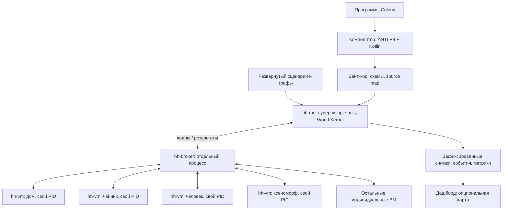

# Язык и среда исполнения LV-426

Статус: проектное предложение, без реализации. Основание — [исходное задание](lab-description.md) и новые требования пользователя: 300+ стековых ВМ, отдельный процесс ОС для каждой ВМ, ВМ для домов и приборов, отдельный брокер, поведение людей и ксеноморфов на собственном языке, события и вероятности. Подробный [план работ](implementation-plan.md) вынесен отдельно.

Рекомендуемая концепция: **реактивный типизированный язык поведения + стековый байт-код + изолированные процессы ВМ + детерминированная пошаговая симуляция через брокер**. Рабочее название языка — **Colony**, расширение `.colony`.

## 1. Что обязательно, а что предлагается

| Положение | Статус и следствие |
|---|---|
| Примерно 300 домов | Есть в исходном задании; не заменять на 300 произвольных сущностей |
| 300+ стековых ВМ, каждая в своём процессе ОС | Новое обязательное требование; потоки, корутины и массив виртуальных агентов в одном процессе его не выполняют |
| Отдельная ВМ у дома и каждого моделируемого прибора | Новое требование: обогреватель и чайник не должны быть только полями дома |
| Собственный язык описывает автоматику, людей и ксеноморфов | Новое требование; нельзя реализовать их поведение исключительно на C++ |
| ANTLR4 + Kotlin → байт-код → ВМ на C/C++ | Закреплено исходным заданием |
| Отдельный брокер для межпроцессного обмена | Новое требование; язык брокера не ограничен |
| Ориентир на сети процессов Кана | Пользователь уточнил: использовать как ориентир, строгое соответствие не требуется |
| Карта | Опциональна; генерируемая схема достаточна для первого графического варианта |
| Метрики и «аттрактор» | Обычные метрики нужны; пользователь уточнил пожелание о динамическом 3D-вихре, затем явно отложил эту визуализацию на будущее |
| ВМ для каждого человека, ксеноморфа, вездехода и активного узла инфраструктуры | Предлагаемая конкретизация единой архитектуры |
| Один компьютер, статический состав сущностей, шаг 1 модельная секунда | Рабочие допущения MVP, не подтверждённые ограничения преподавателя |
| Память демонстрационного компьютера | Пользователь указал 32 ГБ RAM; CPU, ОС, срок и размер команды пока не известны |

Физические параметры стен и окон, участки дороги, зоны, связи графа и записи финансового журнала — данные. Самостоятельно управляемый прибор — отдельная сущность с ВМ. Какие элементы инфраструктуры имеют собственное поведение, определяет явный каталог; нельзя скрывать самостоятельные приборы в агрегате только ради сокращения процессов.

### 1.1. Сколько процессов получится

Обозначим `H` — дома, `D_h` — число приборов дома, `P` — жители, `X` — ксеноморфы, `V` — транспорт, `I` — остальные программируемые объекты:

```text
N_VM = H + Σ D_h + P + X + V + I
N_OS = N_VM + N_служебных_процессов
```

Пример целевого сценария, который ещё предстоит проверить на доступном компьютере:

| Сущность | Количество отдельных ВМ |
|---|---:|
| Дома | 300 |
| Обогреватели | 300 |
| Чайники | 300 |
| Жители, для начала по одному на дом | 300 |
| Ксеноморфы | 12 |
| Программируемые узлы электричества/связи | 60 |
| Вездеходы | 6 |
| Прочие инфраструктурные установки | 8 |
| **Итого, без служебных процессов** | **1286** |

Это пример состава, а не обещание производительности. Первый технический эксперимент должен измерить стоимость именно такого порядка числа процессов. Для разработки нужны малые сценарии на 3–10 домов; итоговый сценарий сохраняет 300 домов.

## 2. Почему такой язык

Colony описывает **реакцию самостоятельной сущности на наблюдаемое состояние и события**. Дом регулирует отопление, чайник выполняет команду кипячения, человек меняет поведение при стрессе, ксеноморф выбирает цель и атакует. У всех этих задач одна структура: входы → локальная память → условия → намерения совершить действия.

Выбран небольшой императивный язык с реактивными обработчиками:

- `on Event` — реакция на конкретное сообщение;
- `every Duration` — периодическая проверка в модельном времени;
- `state` — личная память поведения;
- `if`, выражения и присваивания — понятные правила;
- перечисления — режимы конечного автомата;
- `chance` и `hazard` — явные точки случайного выбора;
- типизированные события и предметные команды — взаимодействие с миром.

Почему это подходит учебному проекту:

1. Показывает весь путь собственного языка: грамматика, типизация, промежуточное представление, байт-код, стек, интерпретация.
2. Одинаково выражает термостат и поведение существа, не превращаясь в язык только для умного дома.
3. Позволяет ограничить работу одного обработчика и заранее проверять программу.
4. Отделяет политику от физических законов. В DSL решают, **пытаться ли повредить столб**; общее ядро проверяет дистанцию, повреждение и последствия для сети.

Полноценные классы, наследование, динамические потоки, рекурсия, сборщик мусора и произвольный доступ к ОС для первой версии не нужны. Отдельный синтаксис сложных деревьев поведения или машин состояний можно добавить после MVP; сначала достаточно `enum` и условий.

### 2.1. Три слоя описания

| Слой | Что задаёт | Где исполняется |
|---|---|---|
| Программа поведения `.colony` | Правила, память, события, вероятности, команды | На индивидуальной стековой ВМ |
| Сценарий/манифест | Количество объектов, шаблоны, ссылки, графы, seed, шаг, длительность | Генератор и супервизор |
| Каталог моделей мира | Теплопередача, распределение ресурсов, движение, повреждения, тарифы | World Kernel |

Манифест MVP — обычный версионируемый JSON. Например, генератор разворачивает шаблон дома 300 раз и создаёт **разные** идентификаторы и процессы для дома, его приборов и жителей. Генерация использует отдельный seed; итоговый развёрнутый манифест сохраняется.

Байт-код одного шаблона можно загрузить в сотни процессов, но у каждого собственные стек, память, идентификатор и параметры. Количество исходных программ не равно количеству ВМ.

## 3. Архитектура процессов и владение состоянием



Для MVP предлагается C++ для ВМ, брокера и `hh-run`: это сокращает число стеков технологий и позволяет переиспользовать описание протокола. Обязателен C/C++ только для ВМ; выбор брокера — проектное решение. Веб-интерфейс можно сделать отдельно на TypeScript с обычным 2D Canvas.

### 3.1. Индивидуальная ВМ

Процесс `hh-vm` содержит:

- интерпретатор стекового байт-кода;
- локальное состояние поведения, параметры, таймеры и состояние случайных потоков;
- входной кадр с разрешённой проекцией мира;
- выходной пакет команд и событий;
- интерфейс обмена с брокером и средства диагностики.

ВМ действительно выполняет правила своей сущности. Супервизор не должен заменять её исполнение заранее вычисленным ответом. При отсутствии работы процесс ждёт вход, а не крутится в активном цикле. Для каждой сущности работает один экземпляр ВМ в одном процессе; один процесс не обслуживает несколько сущностей.

### 3.2. World Kernel — единый владелец физического мира

Для первой версии рекомендуется централизовать **физическое** состояние и вычисление общих последствий:

| Данные | Единственный владелец |
|---|---|
| Стресс, выбранная цель, режим поведения, запомненная команда | Личная память соответствующей ВМ |
| Позиции, принадлежность зданию, присутствующие в доме | World Kernel, пространственная модель |
| Температуры, здоровье, исправность, фактическая мощность, запас воды | World Kernel, каталог физических моделей |
| Топология и доступность электричества, воды, связи | World Kernel, модели сетей |
| Проводки, счета, принадлежность расходов | World Kernel, подсистема экономики |
| Очереди доставки и состояние соединений | Брокер; это не состояние колонии |

Это сознательная граница MVP: **распределённое поведение, централизованная фиксация физических последствий**. Она не отменяет ВМ каждого дома и прибора. Но если преподаватель требует распределить также численную физику по ВМ, эту границу придётся изменить; это отдельный открытый вопрос.

Причина выбора — простота согласованного состояния. Два ксеноморфа не могут независимо перезаписать здоровье одного столба, дом и житель не считают присутствие по-разному, два устройства не получают один и тот же запас энергии. Все такие конфликты разрешает один детерминированный переход мира.

В ядре допустимы общие механизмы: проверка допустимости действия, распределение мощности, интегрирование температуры, подсчёт ущерба. Недопустимо зашивать туда решения «при стрессе > 80 человек ломает прибор» или «ксеноморф выбирает человека»: они принадлежат DSL.

Центральное ядро может стать ограничением скорости. Для MVP это измеряемый компромисс. Позднее его можно разделить по зонам с явными фазами обмена; распределённые транзакции и несколько машин в первую версию не входят.

## 4. Как использовать сети процессов Кана

В модели KPN последовательные процессы обмениваются данными через направленные FIFO-каналы, не разделяют память, ждут чтения из пустого канала; запись в математической модели не блокируется. Эти свойства при соответствующих ограничениях процессов обеспечивают независимость результата от планирования. KPN сама по себе не требует отдельного процесса ОС на каждый узел. [Lee и Parks, Dataflow Process Networks](https://ptolemy.berkeley.edu/publications/papers/95/processNets/), [Ptolemy II: Process Networks](https://ptolemy.berkeley.edu/ptolemyII/ptII11.0/ptII/ptolemy/domains/pn/doc/main.htm).

Предлагаемая реализация называется **детерминированной дискретной сетью процессов, вдохновлённой KPN**. Наличие TCP, брокера и очередей само по себе не доказывает соответствие строгой KPN.

### 4.1. Представление каналов

У каждой ВМ два логических канала:

```text
Coordinator → input[entity_id] → VM
VM → output[entity_id] → Coordinator
```

У каждого канала один логический отправитель и один получатель. Брокер переносит эти потоки, мультиплексируя их по соединениям. Между ВМ события проходят через детерминированный маршрутизатор координатора: пакет отправителя попадает в закрытый набор текущего шага, адресату событие включается в следующий входной кадр.

Рассылка означает копирование в заданный список получателей. Объединение нескольких источников выполняется после получения полного набора данных за шаг. Семантика «обработать то, что первым пришло по сети» запрещена. Для порядка внутри потока используются последовательные номера; физическое время прибытия не участвует в модели.

На абстрактном уровне фиксированную сеть можно описать как координатор, который читает по одному результату каждого участника и пишет по одному входному кадру, плюс ВМ, преобразующие кадр в результат. Начальные кадры запускают цикл. Это даёт основу для формального сопоставления с KPN, если оно понадобится на защите.

### 4.2. Явные отличия практического MVP

- Вводим логические тики и барьер завершения; исходная KPN не задаёт модель физического времени.
- Используем конечную память и квоты на сообщения. При переполнении завершаем прогон с диагностикой, а не теряем события.
- Фиксируем начальную конфигурацию и seed; псевдослучайные решения становятся детерминированными относительно этих входов.
- Для MVP состав процессов статичен. Смерть жителя меняет состояние, но не убирает его ВМ из барьера.
- Внешние команды записываем в журнал с назначенным модельным тиком. Живой оператор — дополнительный вход, а не источник скрытого недетерминизма.

Неограниченные очереди нельзя буквально реализовать в конечной памяти; вопрос ограниченности произвольных KPN нетривиален, а блокирующая запись может создавать дополнительные тупики. Поэтому мы ограничиваем размер одного кадра и работу обработчиков в выбранной модели, не обещая решение задачи для произвольной сети. [Parks, Bounded Scheduling of Process Networks](https://ptolemy.berkeley.edu/publications/papers/95/parksThesis/).

## 5. Модель времени и одного шага

Обозначения: `S_k` — зафиксированный физический мир, `L_i,k` — личная память ВМ `i`, `Δt` — шаг, `t = k × Δt`. Рабочее значение `Δt = 1s`; оно требует проверки скорости и устойчивости численных моделей.

```text
(L'_i, intents_i, events_i) = Execute(program_i, L_i,k, Frame_i(S_k), random_key_i)
S_(k+1) = WorldStep(S_k, CanonicalMerge(intents_1 ... intents_N), Δt)
L_i,k+1 = L'_i после успешного общего commit
```

### 5.1. Протокол шага

1. **Вход.** Координатор создаёт для каждой ВМ `Frame(k)`: модельное время, нужные наблюдения из `S_k`, события и таймеры. Кадр посылается даже при пустом списке событий.
2. **Поведение.** ВМ последовательно выполняет обработчики, обновляет предварительную личную память и накапливает намерения. Все наблюдения мира в течение шага остаются снимком `S_k`.
3. **Завершение.** ВМ отправляет один `Result(k)` с намерениями, событиями, изменениями личного состояния, контрольным хешем и признаком завершения. Состояние включает также таймеры, случайные счётчики и последовательные номера исходящих событий. Разбиение на части допускается только с общим `count/last_seq`.
4. **Барьер.** Координатор получает результат каждого участника текущего состава. Пустой результат тоже обязателен. Запаздывание процесса не меняет исход симуляции.
5. **Разрешение и физика.** Ядро канонически упорядочивает намерения, проверяет их допустимость, разрешает конфликты, вычисляет ресурсы и физические последствия.
6. **Фиксация.** Новое состояние мира сначала вычисляется отдельно от подтверждённого. После успешного вычисления координатор фиксирует `S_(k+1)`, журнал и личные состояния. Подтверждение может входить в следующий кадр; до него ВМ хранит изменения как предварительные и не начинает следующий тик. UI получает только зафиксированное состояние. Для восстановления нужны сами данные/дельты, одного хеша недостаточно.
7. **Следующий шаг.** События о результатах и пользовательские сообщения доставляются в `Frame(k+1)` или позднее, если задана модельная задержка.

Прямой синхронный запрос другой ВМ внутри обработчика запрещён: ожидание ответа до собственного `Result` привело бы к взаимному ожиданию на барьере. Ответ на предметную команду — событие следующего шага. Исполнение цикла сообщений до «стабилизации» внутри одного тика также запрещено.

### 5.2. Порядок правил

- Сначала входные события в порядке `(source_entity_id, source_sequence)`; служебные источники тоже имеют стабильные идентификаторы. Если есть запланированные доставки, сначала учитывается `delivery_tick`.
- Для одного события обработчики выполняются в порядке объявления в программе.
- Затем выполняются периодические обработчики, которым наступил срок, также в порядке объявления.
- Локальные присваивания видны следующим обработчикам этой ВМ. Ни один обработчик не видит незафиксированные изменения физического мира.
- `every P` срабатывает при `t = 0, P, 2P, ...`; период должен быть положительным и кратным `Δt`. Другой старт задаётся явной фазой таймера в будущей версии.
- Нулевые задержки и бесконечные циклы событий не разрешены. Для отложенной отправки минимальная задержка — один тик.

### 5.3. Разрешение конфликтов

Сортировки сообщений мало: для каждой команды нужна предметная политика. Намерения `power.request` и `motion.request` действуют только на переход `k → k+1`; в начале следующего тика их слоты пусты. Отсутствие запроса означает нулевую мощность и отсутствие движения. Длительное действие требует повторной команды или отдельного явно описанного задания на ремонт.

| Конфликт | Предлагаемое правило MVP |
|---|---|
| Повторные запросы мощности одного прибора | Один итоговый слот запроса; последнее присваивание в установленном порядке внутри его ВМ |
| Несколько атак одного объекта | Проверить дистанцию по `S_k`, сложить допустимый урон в стабильном порядке, ограничить здоровье снизу нулём |
| Атака и уход цели | Атака допустима по позиции в начале шага; перемещение не отменяет уже допустимую атаку |
| Повреждение и ремонт | Сначала урон; ремонт допускается для оставшегося ремонтопригодного объекта при наличии ресурсов; разрушенному нужен отдельный процесс восстановления |
| Дефицит мощности | Фиксированный класс потребителя, затем `entity_id`; распределять по одному описанному правилу, не по времени сетевого прихода |
| Недостаток денег/запчастей для ремонта | Явный отказ команды и событие причины; не создавать отрицательный склад неявно |
| Несколько команд движения одного агента | Один итоговый слот намерения; столкновения и проходимость решает пространственная модель |

Внутри WorldStep фиксируем фазы: проверка по `S_k` → повреждения/ремонты → доступность сетей и распределение ресурсов → интегрирование тепла/воды/расходов → фиксация движения и присутствия → события. Повреждение провода может отключить питание уже на этом шаге. Замерзание, обнаруженное при интегрировании, меняет доступность воды со следующего шага. Эти решения входят в спецификацию, а не зависят от порядка обхода контейнеров.

Атаки считаются одновременными по `S_k`: две живые в начале шага сущности могут повредить друг друга. После фазы урона уничтоженные сущности уже не двигаются и не потребляют мощность, даже если прислали такие намерения. Запрос от сущности, не способной действовать уже в `S_k`, отклоняется.

### 5.4. Что значит «нет людей — выключить обогрев»

Дом и обогреватель — разные ВМ. Дом посылает желаемый режим, обогреватель самостоятельно проверяет присутствие по авторитетному снимку и формирует запрос мощности. Желаемое состояние и фактически выделенная мощность — разные величины.

Для MVP принимаем **реакцию за один модельный шаг**: если в `S_k` людей нет, обогреватель запрашивает нулевую мощность на этот шаг. Если последний человек вышел при переходе `S_k → S_(k+1)`, это станет наблюдаемым входом в следующем кадре; отопление выключится не позднее следующего шага. Доставка старой команды «включить» не отменяет локальную проверку присутствия.

Если требуется строгий инвариант на каждом опубликованном снимке `occupants == 0 ⇒ actual_power == 0`, понадобится дополнительная фаза «перемещение → обновление присутствия → выполнение автоматики». Такой инвариант нельзя обещать для одного общего снимка без дополнительной семантики. Ожидаемую задержку нужно явно включить в приёмку.

### 5.5. Скорость и внешние события

Пауза, пошаговое выполнение и ускорение меняют темп запуска шагов, но не `Δt`. Логическое время не читается из часов ОС. Watchdog использует реальное время только для диагностики зависания; он не убивает человека в симуляции и не пропускает его результат.

Вмешательство пользователя во время работы фиксируется как вход с конкретным тиком. При повторе используются те же входы. Без этого одинакового seed недостаточно для одинакового результата.

## 6. Брокер и транспорт

Брокер — отдельный исполняемый процесс. Он регистрирует подключения, проверяет идентификаторы и номера кадров, маршрутизирует сообщения, хранит FIFO и отдаёт транспортные метрики. Он не выбирает цели ксеноморфов, не рассчитывает температуру и не принимает решения о ремонте. Барьером логического времени управляет координатор.

Для первого прототипа: TCP loopback, постоянное соединение на ВМ, длина кадра + UTF-8 JSON с фиксированной схемой и лимитом размера. Это проектный выбор ради простоты проверки протокола. Если ранний нагрузочный эксперимент покажет, что сериализация мешает, заменить тело на бинарный формат, сохранив семантику и номера полей/версии. Не начинать одновременно с нескольких транспортов и кластерного развёртывания.

Минимальные сообщения: `Hello`, `Ready`, `Frame`, `Result`, `Commit/Stop`, `Fault`; оболочка содержит `protocol_version`, `run_id`, `entity_id`, `tick`, `sequence`, `payload_length`. Соединение привязано к зарегистрированной ВМ; присланный внутри пакета идентификатор не даёт права выдать себя за соседнюю сущность.

Важные свойства:

- Сначала запускаются брокер и координатор, затем ВМ; первый тик начинается после `Ready` всех ожидаемых участников.
- Кадр содержит только нужные наблюдения и события, а не копию всего мира для каждой ВМ.
- Пакет результата и его завершение передаются в одном упорядоченном потоке. Признак завершения не может «обогнать» команды.
- Дубли с тем же `(run_id, entity_id, tick, sequence)` обнаруживаются; повтор не применяет действие второй раз. В MVP разрыв соединения завершает прогон, поэтому обещания exactly-once через произвольные переподключения не требуется.
- Предметные события не теряются молча. Для визуализации можно заменять старые кадры более свежими, поскольку она читает отдельный поток наблюдения.
- Очереди, объём результата и число команд ограничены. Нарушение квоты — диагностируемая ошибка прогона, не случайное изменение мира.
- Запись в логический выходной буфер не ждёт решения другой ВМ. Реальный сокет может ждать транспорта; это часть практического исполнения, а не новая операция ожидания в DSL.
- Брокер и координатор обслуживают чтение и запись одновременно в своём цикле I/O. Схема «сначала блокирующе отправить всем большие кадры, затем читать результаты» может застрять на конечных транспортных буферах; этот случай входит в нагрузочный эксперимент.

**Интернет колонии и транспорт симулятора — разные системы.** Повреждённый кабель задаёт недоступность связи и задержки для моделируемых команд, но не отключает TCP-соединение ВМ с брокером. Доступ к датчикам зависит от схемы наблюдений: локальный датчик может работать без связи, удалённое наблюдение становится `Unknown`. Домашнюю автоматику нельзя делать всеведущей через общую память ядра.

## 7. Ядро языка Colony

### 7.1. Конструкции и типы

| Конструкция | Назначение |
|---|---|
| `behavior Name for Kind` | Программа для сущности заданного вида |
| `param` | Неизменяемый параметр конкретного экземпляра |
| `state` | Изменяемая личная память ВМ |
| `event` | Схема типизированного сообщения |
| `on Event(message) as rule_name` | Обработка доставленного события |
| `every 1s as rule_name` | Периодическое выполнение; имя правила стабильно для диагностики и случайных потоков |
| `let`, `if`, `else`, `if let` | Локальные вычисления, ветвление и безопасное раскрытие `Option` |
| `send event to ref` | Сообщение другой сущности через брокер и координатор |
| Предметная функция `power.request`, `damage.request`, `motion.request` | Намерение изменить физический мир |
| `chance(p, site)` | Испытание с вероятностью `p` в явно указанной точке |
| `hazard(rate, site)` | Испытание по интенсивности за один базовый шаг; разрешено в обработчике с периодом `Δt` |

В MVP: `Bool`, `Int64`, `Real64`, `Duration`, `Probability`, `Rate`, `Money`, перечисления, записи событий, `Ref<Kind>`, `Option<T>` и ограниченные списки наблюдений. `Money` хранит целые минимальные денежные единицы, а не двоичную дробь.

Для физических величин нужен небольшой фиксированный набор типов: `Temperature`, `Power`, `Energy`, `Volume`, `Distance`, `Speed`, `Health`. Литералы вроде `18degC`, `2kW`, `2m`, `5mps`, `20hp` переводятся в согласованные внутренние единицы. Полная алгебра произвольных размерностей необязательна; таблицы разрешённых операций достаточно. В частности, абсолютная температура и разность температур требуют разных правил сложения.

`view` — типизированная неизменяемая проекция текущего кадра, её схема зависит от вида сущности. `Ref` идентифицирует объект, но не открывает доступ к его памяти. Обращение `other.stress = 0` запрещено. Списки соседей ограничены радиусом и размером; при равной дистанции порядок задаётся стабильным ID. Отсутствующий датчик представлен `Option`, а не произвольным нулём.

У эффектов есть три категории: чистые вычисления; изменение личного `state`; отправка сообщений/команд и случайный выбор. Чистая функция не может тайно послать событие, изменить память или прочитать часы ОС. Функции без рекурсии можно добавить после первых трёх демонстрационных программ.

Произвольные `while`, рекурсия, динамическое создание сущностей, сетевые вызовы, файловый ввод-вывод и доступ к системному времени не входят в первую версию. Ограниченный `for` по наблюдениям — возможное расширение; для MVP достаточно стандартных функций поиска и агрегации.

### 7.2. Дом и отдельный обогреватель

Примеры ниже — **проект будущего синтаксиса**, не существующая реализация. Типы входных наблюдений и предметных функций входят в стандартный контракт языка с ядром.

```text
event HeatingDemand { enabled: Bool; }

behavior HouseControl for House {
    param heater: Ref<Heater>;
    state demand: Bool = false;
    state sent: Option<Bool> = none;

    every 1s as regulate {
        if view.occupants == 0 {
            demand = false;
        } else if view.temperature < 18degC {
            demand = true;
        } else if view.temperature >= 21degC {
            demand = false;
        }

        if sent != some(demand) {
            send HeatingDemand { enabled: demand } to heater;
            sent = some(demand);
        }
    }
}

behavior HeaterControl for Heater {
    state demand: Bool = false;

    on HeatingDemand(message) as remember {
        demand = message.enabled;
    }

    every 1s as apply {
        if view.home_occupants == 0 || view.broken || !view.power_connected {
            power.request(0W);
        } else if demand {
            power.request(2kW);
        } else {
            power.request(0W);
        }
    }
}
```

Обе программы выполняются в собственных процессах. Дом выбирает режим с гистерезисом 18–21 °C; обогреватель проверяет местные условия. Фактическую мощность определяет распределитель энергии, поэтому запрос `2kW` может получить меньшую мощность или отказ. `power.request` по умолчанию адресован самому прибору; чужой прибор через него включить нельзя.

В этом примере локальный проводной канал дом–обогреватель считается надёжным, а значения датчиков доступны. Для ненадёжной моделируемой связи потребуются подтверждение команды и периодический повтор; для неисправного датчика — обработка `Unknown`. Эти расширения не должны появляться как скрытые свойства `send`.

Чайник использует тот же язык: команда `Boil`, локальный режим `Idle/Heating`, запрос мощности, наблюдение температуры воды и событие завершения. Вода нагревается по физической модели, а не мгновенно меняется присваиванием в DSL. Чайник имеет отдельную ВМ даже при одинаковой программе всех 300 экземпляров.

### 7.3. Житель: стресс, вероятность и повреждение

```text
behavior Resident for Human {
    enum Mood { Calm, Agitated }
    state mood: Mood = Calm;
    state stress: Real64 = 0.2;
    state next_attempt: Duration = 0s;

    on PowerLost(message) as react_to_outage {
        stress = clamp(stress + 0.15, 0.0, 1.0);
    }

    every 1min as reconsider {
        if view.cold {
            stress = clamp(stress + 0.04, 0.0, 1.0);
        } else {
            stress = clamp(stress - 0.02, 0.0, 1.0);
        }

        if stress > 0.8 {
            mood = Agitated;
        } else if stress < 0.4 {
            mood = Calm;
        }

        if mood == Agitated && time >= next_attempt {
            if let target = nearest(view.reachable_breakables) {
                if chance(0.15, "vandalism") {
                    damage.request(target.id, 20hp, Vandalism);
                    next_attempt = time + 10min;
                }
            }
        }
    }
}
```

Здесь 15% — вероятность одной попытки в минуту при выполненных условиях и наличии цели. После отправки попытки наступает пауза 10 модельных минут, даже если ядро впоследствии отклонит действие. Если нужна пауза только после успеха, её следует назначать в обработчике `ActionSucceeded`. Это разные политики поведения.

Ядро проверяет допустимость повреждения и дальность. Повторные попытки могут накопить урон и сломать объект. Успешную поломку фиксирует подтверждённое событие ядра, а не сам факт выполнения `damage.request`. Нельзя считать «человек разозлился» и «предмет гарантированно сломан» одним событием.

### 7.4. Ксеноморф: выбор цели, движение, атака

```text
behavior Xenomorph for Alien {
    enum Mode { Patrol, Chase, Attack }
    state mode: Mode = Patrol;

    every 1s as decide {
        if let target = nearest(view.visible_infrastructure) {
            if target.distance > 2m {
                mode = Chase;
                motion.request(target.position, 5mps);
            } else {
                mode = Attack;
                if hazard(0.4per_s, "strike") {
                    damage.request(target.id, 35hp, XenomorphAttack);
                }
            }
        } else {
            mode = Patrol;
            motion.request(view.patrol_waypoint, 2mps);
        }
    }
}
```

Входное наблюдение содержит видимую инфраструктуру и геометрию. Решение преследовать цель или атаковать выражено в DSL. `nearest` использует заданное отношение расстояния и при равенстве выбирает меньший ID. Каталог моделей проверяет проходимость и скорость; назначенная в манифесте точка патруля может обновляться по подтверждению прибытия.

Пример атакует инфраструктуру. Для охоты на людей автор программы выбирает другой тип наблюдений и правила приоритетов. Не нужно добавлять в ВМ инструкцию `RUN_XENOMORPH_AI`, содержащую весь алгоритм существа.

### 7.5. Вероятности и воспроизводимость

`chance(p, site)` проводит ровно одно испытание при достижении выражения. `p` лежит в `[0,1]`: константа вне диапазона — ошибка компиляции, динамическое неверное значение — ошибка выполнения. Вероятность не зависит от FPS или частоты опроса сокета.

`hazard(λ, site)` в обработчике каждого базового шага использует:

```text
p = 1 - exp(-λ × Δt)
```

Это вероятность хотя бы одного события при постоянной интенсивности на интервале. В примере за 1s она примерно 0.33. Оператор выдаёт максимум одно событие за вызов; для количества независимых событий нужна отдельная пуассоновская операция, отложенная за пределы MVP. Для меняющейся интенсивности используется кусочно-постоянное значение начала шага; уменьшение шага повышает точность такого приближения.

В первой версии `hazard` запрещён внутри редкого таймера или `on`: так не возникает неоднозначности, за какой интервал считается вероятность. В редких обработчиках используется явно периодический `chance`.

Каждая точка случайного выбора имеет ключ `(run_seed, entity_id, rule_name, site)` и собственный счётчик. Алгоритм PRNG, derivation ключей и преобразование числа в вероятность фиксируются версией рантайма. Не использовать системный `hash()` и один глобальный генератор, из которого процессы берут числа в порядке прибытия.

Воспроизводимость означает: одинаковые развёрнутый сценарий, программы, seed, шаг, журнал внешних входов, версия ядра и профиль численной арифметики дают одинаковые предметные результаты. Смена шага или модели не обязана сохранять траекторию. Для MVP обещаем точный повтор на одной поддерживаемой сборке/архитектуре; переносимость бит-в-бит между платформами потребует отдельного численного контракта. Неопределённый порядок суммирования, NaN и системные источники случайности исключаются.

## 8. Компилятор: ANTLR4 + Kotlin

```text
.colony + стандартные схемы
  → ANTLR4 lexer/parser
  → AST с координатами исходного текста
  → разрешение имён и ссылок на типы
  → типы, единицы, допустимые эффекты, контракты событий
  → простое IR: блоки, операции, переходы
  → раскрытие обработчиков, таймеров и предметных функций
  → генерация стекового байт-кода
  → независимая верификация
  → .cvm + source map + описание интерфейса
```

### 8.1. Обязанности этапов

1. **Лексика/синтаксис.** Ключевые слова, литералы с единицами, приоритеты операторов, объявления; сообщения об ошибках со строкой и колонкой. Дерево ANTLR не используется напрямую как вся внутренняя модель компилятора.
2. **AST и имена.** Области видимости, запрет повторного объявления, таблицы событий, параметров, состояний и правил.
3. **Типизация.** Согласовать `send` с типом адресата, раскрывать `Option`, не разрешать сложение мощности и денег; проверить присваивания и типы `view`.
4. **Эффекты.** Запретить внешние операции в чистых функциях; проверить доступность предметной команды для вида сущности и обязательные capabilities.
5. **Семантика времени.** Периоды положительны; совместимость с шагом сценария проверяется при связывании манифеста; имена правил и random-site уникальны в своей области.
6. **IR.** Явные чтения состояния, ветвления и эффекты. Достаточно простого представления с базовыми блоками; сложная оптимизирующая SSA-инфраструктура не нужна.
7. **Lowering.** Сформировать таблицы подписок/таймеров, layout личного состояния, порядок вызовов и вызовы стандартных intrinsics.
8. **Codegen.** Посчитать смещения переходов, константы, максимальные требования к стеку; сохранить связь каждой инструкции с исходной строкой.
9. **Verifier.** Проверить результат независимо от успешного завершения компилятора.

Оптимизации первой версии: свёртка чистых констант и устранение очевидно недостижимых ветвей. Нельзя переставлять случайные вызовы, команды и изменения состояния как обычную арифметику.

### 8.2. Содержимое `.cvm`

Заголовок с сигнатурой и версиями языка/ISA/моделей, таблица констант и типов, описание параметров и личного состояния, таблицы событий и обработчиков, код, требования к стеку/памяти, capabilities, source map, хеш программы. Кодировка чисел и порядок байтов задаются спецификацией, а не дампом C++-структур.

Связывание сценария дополнительно проверяет существование ссылок, соответствие программ видам сущностей, параметры, топологию наблюдений и совместимость периодов с `Δt`. Для обработчика с `hazard` период должен быть именно равен `Δt`, одной кратности недостаточно. Один неверный экземпляр должен обнаруживаться до запуска тысячи процессов.

Для защиты нужны дизассемблер и возможность показать цепочку «исходная строка → инструкции → изменившийся state → событие/команда». Они полезнее раннего IDE-плагина.

## 9. Стековая виртуальная машина

Внутри ВМ: указатель инструкции, стек операндов, ограниченный стек вызовов, слоты локальных переменных, отдельные слоты личного состояния, read-only таблица констант и текущий кадр. Модель значений задаёт явные теги типов; сырой указатель C++ не является значением DSL.

| Группа | Пример инструкций | Эффект на стек |
|---|---|---|
| Константы/память | `PUSH_CONST`, `LOAD_STATE`, `STORE_STATE` | `[] → [T]`, `[T] → []` |
| Наблюдения | `LOAD_VIEW field_id` | `[] → [T]` из текущего снимка |
| Арифметика | `ADD_I64`, `ADD_REAL`, `MUL_REAL`, `CMP_LT` | `[a,b] → [result]` |
| Управление | `JUMP`, `JUMP_IF_FALSE`, `CALL`, `RETURN` | Условный переход снимает `Bool` |
| Данные | `MAKE_RECORD`, `GET_FIELD`, операции `Option` | По известной схеме типа |
| Случайность | `CHANCE site_id`, `HAZARD site_id` | `[Probability/Rate] → [Bool]` |
| Взаимодействие | `SEND`, `INTRINSIC id` | Снять аргументы, добавить запись в outbox или вернуть чистый результат |
| Цикл ВМ | `RECV_FRAME`, `END_TICK`, `TRAP` | Управляет кадром, завершением и ошибкой |

`RECV_FRAME` — служебная блокирующая операция цикла исполнения, недоступная как произвольный `receive` внутри обработчика. `END_TICK` завершает работу всех обработчиков кадра, не только одной ветви.

Например, условие `view.occupants == 0` для команды выключения разворачивается в обычные стековые операции:

```text
LOAD_VIEW   occupants     ; [] → [Int64]
PUSH_CONST  0             ; [Int64] → [Int64, Int64]
CMP_EQ                    ; [Int64, Int64] → [Bool]
JUMP_IF_FALSE occupied    ; [Bool] → []
PUSH_CONST  0W            ; [] → [Power]
INTRINSIC   POWER_REQUEST ; [Power] → [], записывает намерение
occupied:
...
```

Это иллюстрация фрагмента, а не полный цикл исполнения. Разделение стека и постоянного состояния обязательно: стек очищается на установленной границе, `state` сохраняется между тиками.

### 9.1. Общие предметные опкоды

Пользователь допускает инструкции, объединяющие несколько атомарных операций. Предлагается версионируемый реестр `INTRINSIC`:

| Операция | Что делает |
|---|---|
| `NEAREST` | Проверяет ограниченный список наблюдений, вычисляет минимум со стабильным tie-break, возвращает `Option<T>` |
| `POWER_REQUEST` | Проверяет тип/границы и capability, обновляет слот намерения мощности своей сущности |
| `MOVE_REQUEST` | Формирует типизированное намерение движения |
| `DAMAGE_REQUEST` | Формирует намерение урона с адресатом, величиной и причиной |
| `REPAIR_REQUEST` | Формирует заявку на ремонт; результат приходит событием |
| `SEND_EVENT` | Упаковывает типизированное сообщение и адресата |

У каждого intrinsic описаны сигнатура, stack effect, эффект на локальные данные, допустимые виды сущностей, сложность и стоимость в бюджете шага. Например, `NEAREST` стоит пропорционально размеру списка, а не «одна бесплатная инструкция» для произвольного объёма работы.

Предметный opcode сокращает упаковку, поиск или проверку, но не прячет всё поведение человека/ксеноморфа. Он атомарен только относительно исполнения своей ВМ; распределённой транзакцией такая инструкция не становится. Тепловое интегрирование остаётся только в World Kernel, чтобы температура не вычислялась дважды.

### 9.2. Верификация и ограничения

Верификатор проверяет допустимость опкодов, размеры секций, индексы, границы инструкций и переходов, совместимость типов/высот стека при слиянии ветвей, инициализацию локальных переменных, сигнатуры вызовов, схемы сообщений и capabilities. Ошибка загрузки не должна приводить к чтению за пределами буфера в нативном коде.

Runtime дополнительно ограничивает число инструкций и стоимость intrinsics на шаг, глубину стека, объём памяти/наблюдений и исходящих команд. Деление на ноль, переполнение целых, неверный доступ к `Option`, нечисловой результат и нарушение квоты имеют определённую диагностику, а не неопределённое поведение C++.

В первой версии динамические квоты — средство обнаружения ошибки. Не следует автоматически обрезать программу по бюджету и фиксировать половину её команд как успешный шаг.

## 10. Супервизор, сбои и ресурсы

### 10.1. Жизненный цикл

Супервизор проверяет манифест и байт-код до массового запуска, создаёт каталог прогона, запускает брокер, поднимает по одному `hh-vm` на каждую сущность, собирает `Ready`, затем начинает модельное время. Он хранит отображение `entity_id → PID → program_hash` и показывает его в диагностике. Процессы ВМ запускаются без отдельного видимого окна на каждый прибор.

При остановке супервизор завершает только процессы своего прогона и проверяет, что они действительно вышли. При частичной ошибке старта уже запущенные дочерние процессы освобождаются. Убитый процесс, зависшая программа и игровое разрушение объекта — разные ситуации.

В MVP авария процесса, ошибка ВМ, разрыв транспорта или превышение квоты останавливают прогон на последней подтверждённой границе. Нельзя молча удалить участника барьера и продолжить «как будто он погиб». Диагностика: прогон, сущность, PID, тик, правило, исходная строка, причина и последние предметные действия.

На первом этапе восстановление — повтор запуска с теми же входами. Автоматический перезапуск отдельной ВМ и продолжение с нулевой памятью недопустимы. Полноценные checkpoints можно реализовать позже; они должны включать весь мир, личные состояния всех ВМ, таймеры, случайные счётчики, будущие события, состав участников, шаг, версии и хеши программ. Снимать их нужно на общей границе, а восстанавливать согласованно.

### 10.2. Бюджет для компьютера с 32 ГБ RAM

32 ГБ — подтверждённый объём RAM, но неизвестны процессор, ОС и доступная память после запуска других программ. Поэтому бюджет считается по измерениям:

```text
RAM_project ≈ N_VM × private_memory_per_VM
            + world_state + broker_queues + input_frames
            + telemetry + UI + служебные накладные расходы
```

Для 1286 ВМ условные 4 MiB частной памяти на процесс дают около 5.0 GiB; 16 MiB — 20.1 GiB; 32 MiB — 40.2 GiB. Это арифметические сценарии, **не измеренная стоимость** нашей будущей ВМ. Общий исполняемый код частично разделяется ОС, но стеки, локальная память и многие системные структуры имеют отдельную стоимость.

Предварительная цель — оставить ОС и остальным программам около 8 ГБ, а проект удержать в оставшейся памяти с запасом. Уточнить после замеров private/committed memory и фактического потребления всей системы; простое суммирование RSS процессов может повторно учитывать общие страницы.

Меры, заложенные в дизайн:

- Один компактный нативный исполнитель, без JVM или браузера в каждом процессе.
- Ограниченные стеки, личная память и буферы; предварительные размеры определяются после spike.
- Блокирующее ожидание кадра и отсутствие отдельного служебного потока на каждый таймер.
- Пакеты на тик вместо отдельного сетевого пакета на каждую операцию языка.
- Наблюдения только о доступном окружении; никаких `N × полный_мир` копий.
- Ограниченная история UI и редкое подробное логирование. Пустые действия не обязаны создавать запись на диск.
- Ускорение симуляции ограничено реальным временем шага. Тысяча процессов не означает тысячу параллельно работающих ядер.

Отдельно измерять CPU в ожидании и под нагрузкой, число соединений/дескрипторов, переключения контекста, старт/остановку, медиану и p95/p99 тика. Если цель не достигается, сокращать избыточные буферы и обмен, затем необязательную детализацию сценария. Замена множества ВМ одним процессом противоречит требованию.

Переход к редкому пробуждению неактивных приборов возможен после MVP: процесс сохраняется, а протокол явно задаёт следующий срок его участия. Самовольно исключать «молчащую» ВМ из текущего барьера нельзя.

### 10.3. Цена длинного прогона

30 модельных суток при `Δt = 1s` — 2 592 000 шагов. При 1286 ВМ это более 3.3 миллиарда исполнений кадра. Даже средний тик в 10 ms даёт около 7.2 часа реального времени на месяц; это условный расчёт, не результат измерения. Кнопка «ускорение ×1000» не устраняет эту работу.

Ранний spike должен дать оценку `T_month = 2 592 000 × mean_tick_time`. По ней выбираются длительность живой демонстрации и возможность полного прогона заранее. Если месяц нужно считать за минуты, потребуется явная следующая итерация: несколько частот обновления при сохранении отдельных процессов либо отдельный сценарий с более крупным шагом и согласованными периодами/моделями. Изменение шага меняет численную и вероятностную модель; это не оптимизация с автоматически тем же результатом. Проверка перехода границы месяца отдельно не заменяет полный месячный расчёт.

## 11. Минимальные модели мира

Физика нужна для причинных последствий: случайность может инициировать поломку, но дальнейшее остывание дома и счёт за электричество должны следовать модели.

| Подсистема | Модель первой версии | Явное упрощение |
|---|---|---|
| Климат | Температура, атмосфера, влажность, давление, ветер, осадки, день/ночь; профили по модельному времени | Одна погода на посёлок, без пространственной метеорологии; часть параметров может быть постоянной |
| Дом | Одно тепловое состояние, стены/окна с площадью, толщиной и теплопроводностью | Без комнат и расчёта течений воздуха |
| Электричество | Реактор, солнечная генерация, ИБП, граф сети, заявки и распределение мощности | Баланс ресурсов, без полноценного расчёта электрических режимов |
| Вода | Источник/насос, граф подачи, расход, запас и состояние труб | Без гидродинамики; замерзание по длительности/температуре |
| Связь | Граф доступности и модельные задержки/отказы удалённых команд | Не эмулятор пакетов реального интернета |
| Люди/ксеноморфы/транспорт | Зоны и координаты, скорость, проходимость, расстояние до цели | Простая 2D-геометрия и путь по графу |
| Ремонт | Заявка, исполнитель, длительность, запчасти и подтверждённый результат | Фиксированные нормативы и небольшой набор поломок |
| Экономика | Потреблённые ресурсы, тарифы, проводки и месячные отчёты | Без рыночного ценообразования и кредитной модели |

Для дома допустима модель сосредоточенной теплоёмкости:

```text
G = Σ (conductivity_i × area_i / thickness_i)  [W/K]
dT/dt = (Q_heating + Q_other - G × (T_inside - T_outside)) / C
```

`C` — эффективная теплоёмкость дома в J/K; параметры окон учитываются отдельно. При постоянных на шаге потоках и `G > 0` можно использовать точное решение линейной модели:

```text
T_eq = T_outside + (Q_heating + Q_other) / G
T_next = T_eq + (T_inside - T_eq) × exp(-G × Δt / C)
```

Для `G = 0` используется `T_next = T_inside + (Q_heating + Q_other) × Δt / C`. Нельзя выбирать произвольный большой шаг явного интегратора, а затем считать численный взрыв «аварией колонии». Параметры должны иметь допустимые диапазоны и понятные единицы.

Замерзание труб — явная упрощённая модель: отрицательная температура и накопленная длительность охлаждения увеличивают степень замерзания, превышение порога повреждает трубу. Не считать каждую секунду мороза независимой случайной поломкой, если демонстрируется именно физический каскад.

Солнечная генерация зависит хотя бы от дня/ночи и погодного коэффициента; ИБП имеет заряд, предел мощности и потери. Распределитель не может выделить больше энергии, чем произведено и разрешено отдать из накопителя. Потребление считается по **фактически выделенной** мощности.

### 11.1. Каскад для демонстрации

```text
Ксеноморф выбирает столб в DSL
→ перемещается и отправляет намерение атаки
→ ядро подтверждает повреждение
→ повреждённый участок меняет связность электросети
→ у подключённых домов пропадает питание
→ обогреватели не получают мощность
→ дома остывают по тепловой модели
→ трубы замерзают и повреждаются
→ появляется заявка на ремонт
→ бригада/вездеход выполняет ремонт
→ списываются материалы, энергия и стоимость работ
→ отчёты показывают последствия для посёлка и владельцев
```

Рядом нужен независимый сценарий «люди вышли — отопление выключилось», чтобы успешная демонстрация языка не зависела от случайной атаки. Для защиты использовать сохранённый seed или явное внешнее событие; случайность должна оставаться проверяемой, а не заставлять ждать поломку неопределённое время.

### 11.2. Учёт и календарь

Потреблённая энергия — интеграл мощности за модельное время, вода — фактический объём. Тарифы задаются в манифесте. До округления денежные дроби накапливаются с фиксированной точностью/остатком; округление каждого секундного расхода до целой денежной единицы исказит итог.

Каждая проводка содержит уникальный ID, время, владельца счёта, категорию, количество ресурса, тариф и причину. Расход общего имущества и расход владельца — разные счета. Если посёлок сначала оплачивает ресурс, а затем распределяет стоимость, внутреннее начисление не учитывается второй раз в консолидированном внешнем расходе.

Фактическое потребление накапливается каждый шаг, но отдельная финансовая проводка создаётся за расчётный интервал, например модельный час, с разбиением при смене тарифа/владельца. Ремонт и прочие дискретные расходы записываются отдельно. Остатки округления переносятся между интервалами. Секундная проводка на каждый дом дала бы 777.6 млн записей на один ресурс за месяц, поэтому такая схема хранения не подходит MVP.

Для MVP можно принять модельный месяц в 30 суток; это явно указанное упрощение, а не календарный месяц Земли. Старт периода задаётся сценарием. Нужны отчёт общего имущества, отчёт каждого из 300 владельцев и проверка суммы по первичным проводкам.

Исходный список включает также освещение, мусор, канализацию, шлагбаумы, заборы, животных и морскую пехоту. Их подробное моделирование предлагается вынести за пределы первой версии, явно перечислив это на защите. Минимальный свет, расходы общих служб и необходимые для каскада сети остаются в MVP. Это предложение о границах, а не утверждение, что преподаватель уже согласовал все упрощения.

## 12. Наблюдение, карта и отложенная 3D-визуализация

### 12.1. Метрики и отладка в MVP

Нужны отдельные группы данных:

- **Колония:** выработанная/потреблённая мощность, энергия за период, вода, расходы по категориям, холодные дома, исправность инфраструктуры, активные проблемы и ремонтные заявки.
- **Поведение:** режимы жителей/ксеноморфов, число попыток и подтверждённых действий, доставка событий, причины отказов команд.
- **Среда исполнения:** число ожидаемых/готовых ВМ и их PID, память, время тика, очереди брокера, медленные сущности, ошибки программ.

Дашборд показывает общий статус, выбранный дом с приборами и жителями, временные графики и журнал причин. События связываются через `event_id`, `causation_id`, `entity_id`, `tick`, `rule_id`; от финансовой проводки можно перейти к ремонту и исходной поломке. Операционные тайминги не включаются в хеш предметного результата.

Мониторинг читает зафиксированные снимки. Полное сохранение каждого пустого кадра всех ВМ не требуется: журнал внешних входов, версий и начальных данных обеспечивает повтор; журнал доменных событий объясняет результаты. Подробная трасса опкодов включается для выбранной ВМ и ограниченного числа шагов.

Для временных рядов задаются период сохранения и уровни агрегации: подробное короткое окно для выбранных объектов, более редкие агрегаты для месяца. Суммы ресурсов сохраняют интегралы, а усреднённые мощности — соответствующий интервал времени. Дискретные аварии не исчезают при агрегации. Бюджет диска и рост памяти измеряются наряду со временем тика.

### 12.2. Карта — опциональное расширение

Внутренний граф дорог и зависимостей нужен даже без картинки. Генератор создаёт зоны/координаты домов, электрические и водяные связи, линии связи и маршруты движения. Один повреждённый участок должен отключать именно зависимые объекты.

Если после обязательных этапов остаётся время: простая 2D-схема с домами, столбами, людьми, ксеноморфами и вездеходами, окраска аварий и отображение выбранного объекта. Анимация интерполирует подтверждённые позиции; FPS не управляет временем физики. Редактор карты, 3D-модели и художественные ассеты не нужны для доказательства работы архитектуры.

### 12.3. «Торнадо» отложено пользователем

Сохранённое пожелание: динамически сводить основные метрики — электричество, воду, деньги — в трёхмерное представление, визуально напоминающее торнадо. По последнему уточнению пользователя **проектирование конкретного отображения и реализация сейчас не входят в план MVP**.

Чтобы вернуться к задаче позже, сохраняем синхронные временные ряды с единицами, модельным временем и seed. Тогда можно сравнить прямую нормированную траекторию трёх метрик с отдельным художественным представлением. Накопленные расходы и скорость расходования денег — разные оси; это решение предстоит принять при возвращении к визуализации.

Произвольная 3D-линия не доказывает существование математического аттрактора, а реальные метрики не обязаны образовывать торнадо. Поэтому будущий способ отображения и его подписи нужно согласовать отдельно; форму не следует выдавать за обнаруженное свойство модели.

## 13. Главные решения и причины

| Решение | Причина | Цена/ограничение |
|---|---|---|
| Язык поведения с событиями и таймерами | Одинаково выражает устройства, людей и существ | Требуется точно задать порядок обработчиков |
| Стековая ВМ в каждом процессе | Выполняет условие преподавателя и наглядно демонстрирует собственный ЯП | Память, переключения контекста, старт тысячи процессов |
| Отдельный брокер | Единый транспорт и наблюдаемость обмена | Центральный компонент, который надо измерять |
| Общие логические шаги | Понятные причинность и повторяемость | Медленная ВМ задерживает шаг всех остальных |
| World Kernel владеет физикой | Простое разрешение конфликтов и согласованный учёт | Централизованная физика, ограничение масштабирования |
| Общие intrinsics вместо готового AI | Уменьшают служебный байт-код, сохраняют поведение в языке | Нужен контракт сигнатур, эффектов и стоимости |
| Отдельный random stream на точку выбора | Результат не зависит от планировщика ОС | Seed один не заменяет фиксацию версий и входов |
| 300 домов генерируются из шаблонов | Реальный масштаб без ручного написания тысяч программ | Нужна проверка развёрнутого манифеста |
| Карта опциональна, 3D отложено | Основной риск находится в языке и среде исполнения | Первая демонстрация может быть без графической карты |

Оставшиеся вопросы и рабочие допущения собраны в [open-questions.md](open-questions.md). Последовательность реализации, результаты этапов и критерии приёмки — в [implementation-plan.md](implementation-plan.md).
