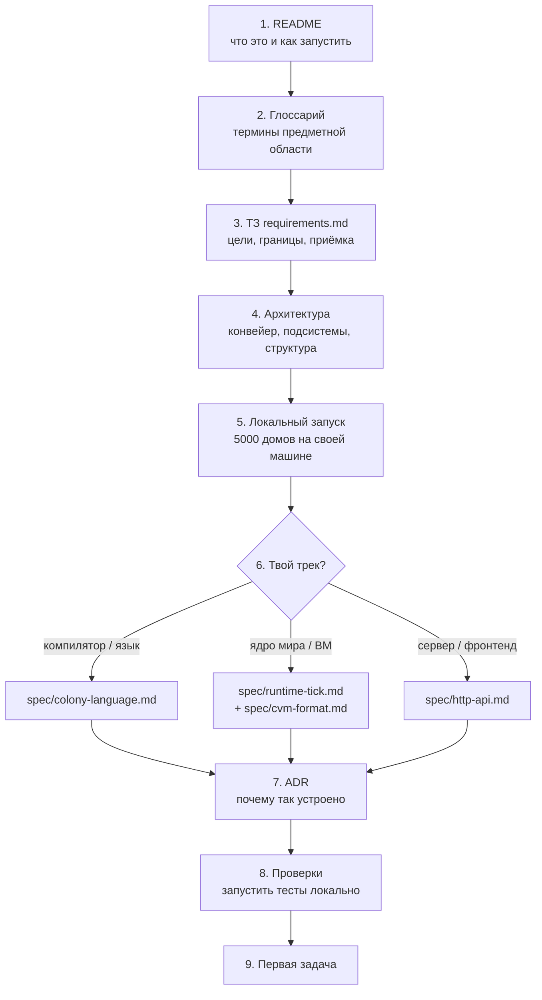

# Онбординг: маршрут нового разработчика

> **Статус:** актуально · **Аудитория:** новый разработчик проекта (один проход, ~3–4 часа) · **Обновлять при:** изменении структуры документации, команд запуска или порядка работ · **Источник истины:** порядок изучения; сами факты — в документах по ссылкам

## Маршрут

## Шаги

1. **README** (~10 мин). Прочитай [README](../README.md): цель проекта, конвейер, способы запуска, карта документации.
2. **Глоссарий** (~10 мин). [glossary.md](glossary.md) — без этих терминов дальше будет тяжело: Клякса, тик, контекст поведения, ровер, креатин, conformance-вектор.
3. **ТЗ** (~15 мин). [requirements.md](requirements.md): что обязательно моделировать, границы первой версии, критерии приёмки и честный статус «что не реализовано». Это критерии, по которым оценивается проект.
4. **Архитектура** (~40 мин). [architecture.md](architecture.md): новые механики (раздел 1), все три диаграммы (раздел 2 — конвейер, компоненты, кросс-проверка), таблица «файл → назначение» (раздел 3), руководство по расширению (раздел 6) — по нему ты будешь добавлять механики.
5. **Локальный запуск** (~20 мин). Из VS Code: `Ctrl+Shift+B` → «Запуск симулятора (5000 домов + Экосистема)», либо PowerShell:
   `.\scripts\start-5000.ps1 -Scenario examples/physics/settlement-5000.json`.
   Проверь: UI на <http://localhost:5173>, `GET <http://localhost:8080/health>` отвечает (`houses` ≥ 5000), карта рисуется.
   Остановка: `.\scripts\stop-5000.ps1`.
6. **Спецификация своего трека** (~30 мин). Компилятор/язык — [colony-language.md](spec/colony-language.md);
   ядро мира и исполнение — [runtime-tick.md](spec/runtime-tick.md) и [cvm-format.md](spec/cvm-format.md);
   сервер/фронтенд — [http-api.md](spec/http-api.md) + `frontend/src/domain/types.ts`.
7. **ADR** (~20 мин). [adr/README.md](adr/README.md) (когда ADR обязателен) и записи 0001–0005:
   кросс-проверка ВМ, процессная модель, spatial-индекс, пул потоков, компактный SSE. Замеры —
   в [history/optimization-5000.md](history/optimization-5000.md).
8. **Проверки** (~15 мин). Собери и прогони: Gradle `test`, CTest, Vitest, `python conformance/run_vectors.py`
   — точные команды в [AGENTS.md](../AGENTS.md). Если всё зелёное, окружение готово.
9. **Первая задача**. Возьми пункт из ТЗ, помеченный как не реализованный, или договорённую задачу;
   порядок работ в конце [requirements.md](requirements.md#что-уточнить-до-реализации).

## Критерий прохождения

Ты готов работать, если можешь: нарисовать по памяти конвейер от DSL до дашборда и объяснить,
зачем две ВМ и как они сверяются; запустить сценарий «5000 домов» и остановить его;
назвать, какие документы обновить после изменения HTTP API.
