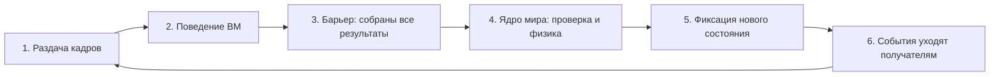
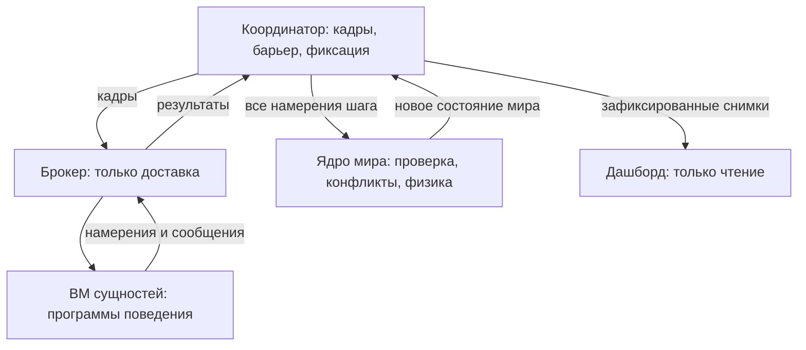

# Взаимодействие сущностей и компонентов: высокоуровневый обзор

Это самый верхний уровень описания симуляции: кто в ней участвует, кто чем владеет и как проходит один шаг. Без формул, обозначений и деталей реализации. Формулы расчётов и условия срабатывания событий будут следующим слоем поверх этого документа. 

## 1. Из чего состоит симуляция

В системе два уровня.

**Посёлок (модель)** — то, что симулируется: дома, приборы, жители, ксеноморфы, вездеходы, инфраструктура, погода, деньги.

**Среда исполнения (компоненты)** — то, что исполняет модель: виртуальные машины, брокер, координатор, ядро мира, супервизор, дашборд.

Каждая **программируемая сущность** посёлка живёт в собственном процессе операционной системы со своей виртуальной машиной, которая исполняет программу поведения этой сущности. Таких сущностей в целевом сценарии около 1286: 300 домов, их обогреватели и чайники, 300 жителей, 12 ксеноморфов, 6 вездеходов и ~70 узлов инфраструктуры. Объединять несколько сущностей в один процесс нельзя.

**Сущности со своей ВМ (думающие):**

| Сущность | Что решает её программа |
|---|---|
| Дом | Режим отопления по температуре и присутствию людей |
| Обогреватель, чайник и прочие приборы | Включение/выключение, запрос мощности, готовность |
| Житель | Распорядок, стресс, движение, вандализм при стрессе |
| Ксеноморф | Патрулирование, выбор цели, погоня, атака |
| Вездеход с бригадой | Куда ехать, что ремонтировать |
| Узлы инфраструктуры (реактор, солнечная станция, ИБП, насос, узлы связи) | Режимы работы, запросы и переключения |

**Без ВМ (просто данные мира, принадлежат ядру):** стены и окна, провода между столбами, трубы, дороги, погода, счета и деньги, задания на ремонт.

**Компоненты среды исполнения:**

| Компонент | Единственная обязанность |
|---|---|
| Программа поведения (язык Colony) | Решает, что сущность **хочет** сделать |
| Компилятор (ANTLR4 + Kotlin → байт-код) | Переводит программы в код для стековой ВМ на C/C++ |
| ВМ — по одному процессу на сущность | Исполняет программу, хранит личную память сущности |
| Брокер — отдельный процесс | Доставляет кадры и результаты. Ничего не решает |
| Координатор | Раздаёт кадры, ждёт все результаты, фиксирует новый мир |
| Ядро мира (World Kernel) | Единолично вычисляет все последствия: сети, тепло, воду, урон, движение, деньги |
| Супервизор | Запускает и останавливает прогон, ведёт журналы |
| Дашборд | Показывает зафиксированные снимки. На симуляцию не влияет |

## 2. Кто чем владеет

| Данные | Единственный владелец |
|---|---|
| Всё физическое: температуры, мощности, здоровье, позиции, сети, погода, деньги, задания | Ядро мира |
| Личные решения сущности: режимы, стресс, цели, таймеры | ВМ этой сущности |
| Очереди доставки сообщений | Брокер |
| Модельное время и порядок шага | Координатор |
| Устройство посёлка: сколько домов, стены, тарифы, пороги | Сценарий (манифест), неизменен во время прогона |
| Графики и картинки | Дашборд (производные данные) |

Всё взаимодействие построено на одном принципе: **решения распределены по ВМ, последствия сходятся в одно ядро**. Ни одна ВМ не пишет в мир напрямую, ядро не принимает решений за сущности.

## 3. Как проходит один шаг

Симуляция не привязана к часам компьютера: время движется дискретными шагами, каждый шаг — одна модельная секунда. Пауза, пошаговый режим и ускорение меняют только темп запуска шагов, но не их содержание.

1. **Раздача.** Координатор собирает для каждой ВМ её кадр: что сущность сейчас видит вокруг, какие сообщения ей доставлены, какие таймеры сработали. Кадры уходят через брокера. Пустой кадр тоже отправляется — это сигнал «новых событий нет, работай по расписанию».
2. **Поведение.** Каждая ВМ исполняет свою программу: обновляет личную память и отправляет результат — намерения («запросить 2 кВт», «атаковать цель», «ехать к точке») и сообщения другим сущностям. Мир внутри шага не меняется: все видят один и тот же снимок его начала.
3. **Барьер.** Координатор ждёт результат от каждой ВМ. Пока не собрались все — шаг не продолжается. Как быстро приходят пакеты — неважно: порядок доставки не влияет на результат.
4. **Мир.** Ядро применяет все намерения разом: проверяет допустимость (жив ли исполнитель, верная ли дистанция, хватает ли ресурса), разрешает конфликты по фиксированным правилам, затем пересчитывает физику и бухгалтерию — электричество, тепло, воду, урон, движение, деньги.
5. **Фиксация.** Новое состояние мира публикуется целиком, одним действием. Дашборд и журналы видят только зафиксированное.
6. **События.** Подтверждения и новости («питание пропало», «труба лопнула», «ремонт завершён») доставляются получателям со следующим кадром.

Компонентная картина того же шага:

## 4. Правила взаимодействия

Короткие «законы», на которых всё держится:

1. **Один снимок на шаг.** ВМ видит мир только таким, каким он был в начале шага. Любые изменения этого шага станут видны в следующем кадре.
2. **Без прямых разговоров.** ВМ не может вызвать другую ВМ и ждать ответа — иначе возникнут взаимные ожидания. Любое сообщение доходит в следующем шаге.
3. **Намерение — не результат.** «Хочу атаковать» проверяет ядро: дистанция, исправность, ресурсы. Успех подтверждается событием ядра, а не фактом отправки команды.
4. **Намерения живут один шаг.** Не повторил запрос мощности — считается нулевым. Долгие дела оформляются явными заданиями в мире (например, ремонт).
5. **Действия одновременны.** Две атаки по одной цели в одном шаге обе проверяются по снимку начала шага; урон суммируется.
6. **Урон раньше ремонта.** Внутри шага сначала применяется урон, затем ремонт — чинится то, что осталось.
7. **Ресурсы не появляются из ниоткуда.** Электричество и вода ограничены источниками и целостностью сетей; при дефиците мощность режется по приоритетам потребителей.
8. **Решения — только в программах поведения.** Ядро не выбирает, кого атаковать и когда чинить. И наоборот: программа не может присвоить температуру или здоровье — только просить, а ядро посчитает.
9. **Сбой процесса — не смерть в модели.** Аварийно умершая ВМ останавливает весь прогон с диагностикой; восстановление — повтор прогона с теми же входами. А гибель жителя или поломка прибора — обычные данные мира: прогон продолжается, ВМ сущности жива и участвует в шагах.
10. **Повторяемость.** Один и тот же сценарий + программы + seed + журнал действий оператора + версии компонентов дают один и тот же результат, независимо от задержек и порядка прихода пакетов.
11. **Наблюдение ничего не меняет.** Дашборд, метрики и логи читают готовые снимки; их закрытие или замедление не влияет на мир.
12. **Связь в посёлке и транспорт симулятора — разные вещи.** Повреждённый кабель рвёт связь между сущностями в модели (датчики становятся «неизвестны»), но TCP-соединение ВМ с брокером продолжает работать.

## 5. Кто с кем общается в посёлке

| Участники | Что передают и как |
|---|---|
| Дом ↔ приборы | Команды и статусы сообщениями: «грей», «включись», «готов» |
| Приборы → ядро | Запрос мощности намерением; обратно — выделенная мощность в кадре |
| Житель ↔ дом и приборы | Команды жильца: отопление, чайник |
| Житель → ядро | Движение, повреждения (при стрессе — вандализм) |
| Ксеноморф → ядро | Движение и атаки; в кадре — то, что видит рядом |
| Бригада/вездеход ← события поломок | Реагирует на события ядра, едет и ремонтирует |
| Все ← координатор | Кадр наблюдений: только своё окружение, а не весь мир |
| Погода, сети, счета | Никому ничего не шлют сами по себе; их состояние ядро включает в кадры тех, кому это видно |

## 6. Два примера на словах

**Чайник.** Житель в своей ВМ решает заварить чай и отправляет чайнику сообщение «вскипяти». В следующем кадре ВМ чайника получает его и запрашивает мощность. Ядро выделяет мощность (если хватает) и греет воду по тепловой модели — температура растёт в мире, а не в программе. Чайник видит в кадре, что вода готова, выключается и отправляет жителю событие «чай готов».

**Каскад аварии.** Ксеноморф в своей ВМ выбирает столб и атакует. Ядро подтверждает урон; столб разрушен — участок сети отключён, и дома за ним теряют питание уже на этом же шаге. Обогреватели без мощности перестают греть, дома остывают по тепловой модели. Когда в домах становится холоднее нуля, у труб копится холод; на пороге труба лопается — вода пропадает со следующего шага. Бригада видит событие поломки в своём кадре, едет и ремонтирует; по завершении списываются материалы и работа, а вся цепочка «поломка → остывание → ремонт → расходы» видна в отчётах и на дашборде.

## 7. Режимы прогона и сбои

- **Пауза** возможна только между зафиксированными шагами; команда не прерывает начатый пересчёт мира.
- **Пошаговый режим** — пауза с командой «сделай один шаг».
- **Ускорение** сокращает реальную паузу между шагами и ограничено реальным временем вычислений.
- **Сбой** (авария процесса, превышение лимитов, разрыв транспорта, зависание) останавливает прогон на последнем зафиксированном шаге с диагностикой; мир остаётся согласованым.
- **Повтор прогона** — новый запуск с теми же входами; результат совпадает (правило 10).

## 8. Что дальше

Этот документ — первый слой: статическая картина и протокол взаимодействия. Следующие слои:

1. **[Расчёты](calculations.md)** — формулы моделей ядра: тепло, электричество, вода, урон, деньги.
2. **[Условия срабатывания](trigger-conditions.md)** — когда возникают события и как формируются наблюдения для каждого вида сущностей.
