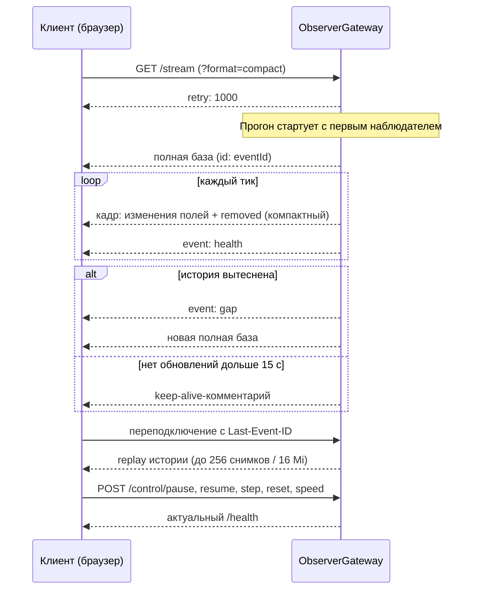

# HTTP/SSE API и наблюдение

> **Статус:** спека · **Обновлять при:** изменении эндпоинтов, формата снимка, политики истории или кодирования

Описание протокола наблюдения и управления прогоном. Контекст предметных событий ядра,
передаваемых в кадрах, — [runtime-tick.md](runtime-tick.md); предметный контракт языка/мира —
генерируемый [contract.json](../generated/contract.json) (он описывает язык и мир, а не HTTP).
Расхождение этого файла, кода шлюза и `frontend/src/domain/types.ts` — баг.

## Эндпоинты

| Метод и путь | Назначение |
|---|---|
| `GET /health` | Статус прогона: версия, режим исполнения, `runId`, статус, тик, заданная скорость, ошибка, `houses`, `contexts`, `behaviorWorkers`, `nativeProcesses`, `observationMode`, `lastStepMs` (время шага без JSON) |
| `GET /stream` | SSE: снимки тиков и статус; `GET /stream?format=compact` — компактная версия 2 |
| `POST /control/pause` | Приостановить прогон |
| `POST /control/resume` | Продолжить прогон (прогон стартует с первым наблюдателем или resume) |
| `POST /control/step` | Один шаг |
| `POST /control/reset` | Сброс прогона |
| `POST /control/speed?value=N` | Задать целевые N шагов/с |
| `POST /control/disaster?kind=reactor&radius=60&damage=100&runId=…` | Взрыв реактора и урон в радиусе (радиус 0–300 м, урон соседям 0–200 HP) |
| `POST /control/disaster?kind=crocodiles&count=3&runId=…` | Запустить 1–32 крокодила при наличии мест в пуле |
| `POST /control/disaster?kind=monsters&count=2&duration=90&runId=…` | Впустить 1–100 живых монстров сценария с окном атаки 10–600 модельных секунд |

Управляющие POST-запросы возвращают актуальный `/health`; некорректное значение скорости — 400.
Команды катастроф также принимаются GET; применяются при следующем шаге под общей блокировкой контроллера
(пауза сохраняется, `reset` очищает очередь). Неверные параметры, чужой `runId`, исчерпанные лимиты
и завершённые прогоны возвращают 400 без постановки в очередь.

Катастрофы в сценариях с физическим миром: `/health` и SSE-статус содержат `disasters` — доступность
реактора, число доступных крокодилов/монстров и размер очереди. Взрыв появляется в журнале как
`ReactorExploded → DamageApplied → ObjectBroken/EntityDied`; поломки создают обычные задачи ремонта.
Вторжение перемещает существующих монстров и временно отменяет отдых; ручные крокодилы используют обычные
полёт, ПВО и бомбардировку даже при отключённом автопоявлении.

## Формат снимка

- Снимок: `version`, `runId`, `runtimeMode`, `seed`, `tickId`, `timestamp`, `full: true`, `entities`, `effects`, `events`, `postings`.
- Сущность: ID, реальный PID или `null`, тип, статус, метрики, координаты, связи и личное состояние.
- `causationId` связывает реальные события; состояния полные, события и проводки относятся к конкретному тику.

Точные схемы: [types.ts](../../frontend/src/domain/types.ts); проверка входа: [dataSource.ts](../../frontend/src/domain/dataSource.ts).
Шлюз: [ObserverGateway.kt](../../colony-dsl-parser/src/main/kotlin/colony/runtime/ObserverGateway.kt).

## Сессия наблюдателя

- `timestamp` — модельное время; новая `runId` сбрасывает UI; повторные тики игнорируются.
- Переподключение — по `Last-Event-ID`; при вытесненной истории приходит `gap`.
- При подключении — `retry: 1000`; каждая пачка кадров завершается служебным событием `health` (те же данные, что `GET /health`); при отсутствии обновлений дольше 15 с — keep-alive-комментарий.
- Лимиты: обычная история — 256 снимков и 16 Mi символов JSON; одновременных клиентов — не более шести.
- `HH_COMPACT_OBSERVER=1`: до восьми структурированных снимков / 250 000 записей сущностей (минимум один); полный JSON — только по запросу обычного клиента.
- `GET /stream?format=compact` (версия 2): полный первый кадр, затем изменения полей сущностей и `removed`; `baseTick` должен совпадать с предыдущим тиком; полная база — после подключения, смены прогона или `gap`.
- Каждый тик передаёт все события и проводки; намерения `effects` остаются только в полном `/stream` и JSONL.

## Поведение UI

- Конверт и изменённые сущности проверяются до фиксации кадра (проверенные неизменённые переиспользуются); повторные тики не начисляют деньги повторно.
- Карта: пространственный индекс, отсечение за границами экрана, группировка домов/жителей/опор при масштабе ниже 0,4, общие графические контексты значков; выбранная сущность остаётся отдельной, клик по группе приближает карту.
- Экологические зоны (лес, навоз, планктон) отображаются площадными слоями, без значков в центре клетки.
- Карта, топология, графики, расходы и инспектор показывают зафиксированное состояние; CSV содержит метрики снимка.
- Sidebar: фазовый портрет последних 10 000 точек с CSV-экспортом; кнопка «Открыть 3D портрет» — последние 3000 точек
  через Three.js. Оси: средняя температура, фактически выданная потребителям мощность и накопленный баланс
  (доходы минус расходы всех полученных тиков, без обрезания по окну проводок); масштаб подбирается по истории,
  мощность не ограничена 2 МВт. 3D-координаты нормируют те же показатели, без искусственной спирали по времени.
  Момент `ReactorExploded` помечается оранжевым маркером; одиночный скачок может отображаться как переходный
  процесс — классификация обновляется каждый тик и является эвристикой наблюдаемых показателей.
